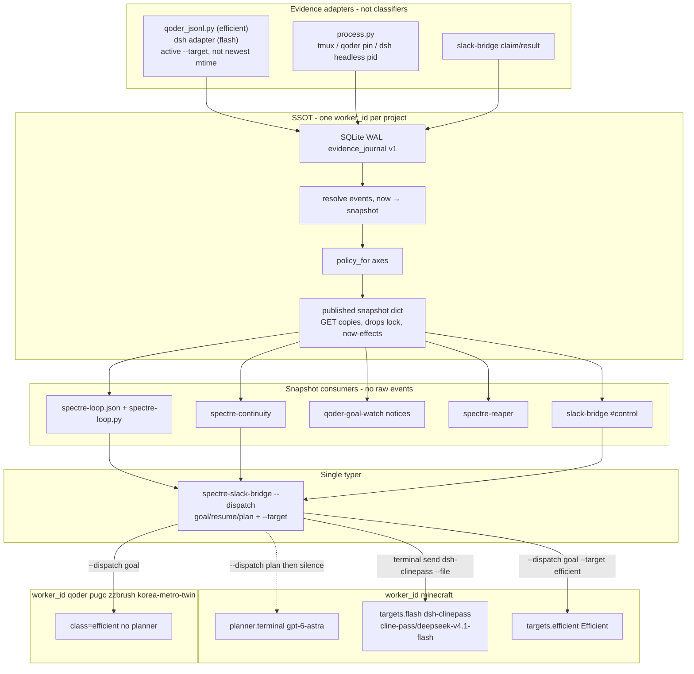
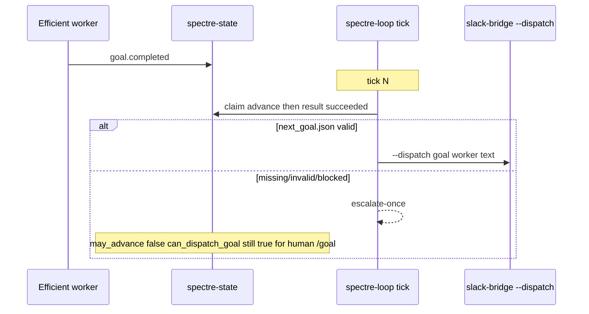
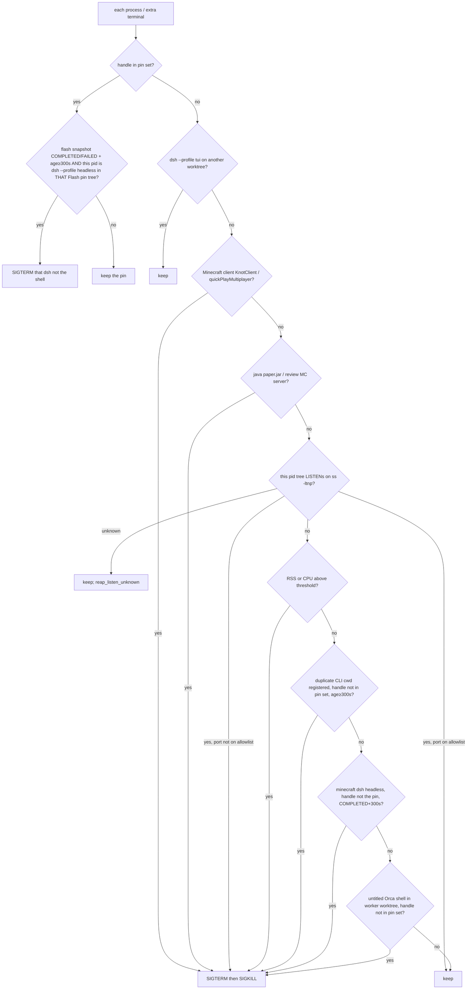

# Spectre Control Plane — Clean-Slate Occupancy and Dispatch

| Field | Value |
|---|---|
| **Title** | Spectre Control Plane: one occupancy authority, one typed dispatch path |
| **Author** | TBD (operator review) |
| **Date** | 2026-09-20 (rev 10; wrapper idle 900 s / wall 6 h; PR 1 bootstrap lock) |
| **Status** | Draft |
| **Repo** | `/home/person/Projects/distribution-project/remote-agent` (branch `feat/status-http-claude-health`) |
| **Box** | HP Spectre XT TouchSmart 13-2000 (i7-3517U 2C/4T, 12 GiB RAM, Debian 13). Agent runtime, not a compile farm. |
| **Canonical docs to update after merge** | `RUNBOOK.md` §7.8, §7.10, §7.16, §7.17 (new §7.18); `AGENTS.md`; `config/qoder-workers.json`; `config/qoder-goal-clause.md` |
| **Live probes** | ssh spectre 2026-09-20 ~20:42, ~20:57, ~22:01 KST (wrapper mode **664**, not executable). No secrets printed. |

This document is the design for replacing the overlapping classifiers, planners, and healers on the Spectre worker box with a single occupancy authority and a single typer. It unifies the Fullmoon Astra policy (`~/.local/share/fullmoon-agent-control/ASTRA_ORCHESTRATION.md`, 2026-09-18) into this git tree. It does not treat `/home/person/remote-agent-deploy/remote-agent/` as source of truth.

---

## Overview

The Spectre box is supposed to run an unattended infinite agent loop: assign a goal, complete it, assign the next, without a human watching. Occupancy already has a resolver (`scripts/worker_state/`, version 1.0.1) with policy flags (`can_dispatch_goal`, `can_resume`, `continuity_recovery_allowed`, `grokbot_may_advance`) and a single typer (`scripts/slack-bridge.mjs --dispatch`). Live reality on 2026-09-20 is the opposite: systemd user units point at a ChatGPT-MCP-edited deploy tree, retired classifiers are enabled again, Astra (`gpt-6-astra`) is pinned to ChatGPT Plus (`-c model_provider=openai`), and completed workers sit idle for 16–19 h because nothing consumes `grokbot_may_advance`.

The proposal is alternative **C**: keep resolver 1.0.1 as the exclusive occupancy authority, keep the Slack bridge as the exclusive typer, add one in-box loop that reads snapshot `policy.*` and `goal.state` (never raw jsonl), wake `gpt-6-astra` **only for `minecraft`**, and run every other worker as Qoder Efficient (0x) via `next_goal.json` (never `ROADMAP.md`). **One occupancy identity per project.** Minecraft Flash primary is **DeepSeek Harness via `dsh-clinepass` (ClinePass quota, `cline-pass/deepseek-v4.1-flash`)**, not `qodercli`. Qoder Efficient stays the mechanical secondary. Fullmoon’s event-driven Astra policy is imported, not run as a second control plane. Deploy-tree timers, Grok CLI `goal-supervisor`, and independent jsonl classifiers are retired for good.

---

## Background & Motivation

### Box profile

- Hardware: i7-3517U, 2 cores / 4 threads, 12 GiB RAM, 256 GB mSATA + 128 GB SATA. Linger-enabled systemd user units. Tailscale SSH in check-mode (`RUNBOOK.md` §7) — a host-side SSH loop dies every 24 h when the browser re-approval URL appears, so the control plane must run on the box.
- Worker stack (`RUNBOOK.md` §7.8): Orca ADE serve `:6768` + Qoder CLI (`qodercli` 1.1.55). Tmux remains for `qoder` (orca-rust) and `pugc` (pugc-ade) until migrated; orca-native pins for `minecraft`, `zzbrush`, `korea-metro-twin`.
- Live load 20:42 KST: load **28.30 / 23.42 / 21.31**, RAM **9.8 / 11 GiB**, swap **7.8 / 19 GiB**. 20:57 KST: load **24.75**, RAM **9.7 / 11 GiB**, swap **7.8 / 19 GiB**. Fabric Minecraft **client** (KnotClient `--quickPlayMultiplayer localhost:25569`) ~80–81 % CPU / ~1.1 GiB RSS plus three listening `paper.jar` (~2.0 GiB / 682 MiB / 616 MiB). `orca-ide terminal list --json` returned ~52 KiB in the 20:57 probe; `codex-goal-healer.timer` (~7 s CPU / ~70 MB per ~90 s tick, RUNBOOK §7.17) is itself an occupancy failure.

### What already exists and must stay exclusive

`scripts/worker_state/` (resolver 1.0.1) is the SSOT that the 2026-09-19 cutover (`RUNBOOK.md` §7.17) already declared:

| Piece | Path / contract |
|---|---|
| Evidence journal | SQLite WAL `~/.local/state/remote-agent/worker-state.sqlite` |
| API | UDS HTTP `$XDG_RUNTIME_DIR/spectre-worker-state.sock` |
| Policy flags | `can_dispatch_goal`, `can_resume`, `continuity_eligible`, `continuity_recovery_allowed`, `grokbot_may_advance` (`scripts/worker_state/policy.py`) |
| Stall (today) | `STALL_MODEL_SEC=900`, `STALL_DEFAULT_SEC=1800` (`scripts/worker_state/types.py`) — this design aligns both to 900 |
| UNCONFIRMED | `INJECTED` older than `UNCONFIRMED_SEC=120` with no authoritative session record |
| Fail-closed | API-down → `UNKNOWN` → all flags false (`FAIL_CLOSED_POLICY`) |
| Typer | `spectre-slack-bridge --dispatch` claims via `POST /v1/actions/claim` then types |
| Guard | `tests/test_worker_state_guard.py` fails CI if a new consumer grows raw-event literals (`hook.finished`, `UpdateGoal`, …) |
| Completion protocol | `config/qoder-goal-clause.md`: verify, commit, Slack `#lobby` report, then `update_goal(status="complete")` |
| Cost gate | `qoder-efficient-guard` stays for Efficient workers |
| Irreversible barrier | `config/codex-irreversible-guard.mjs` stays; approvals off, sandbox full-access |

The resolver fold is pure (`resolve(events, now, worker_id)` in `scripts/worker_state/resolver.py`). Continuity (`scripts/spectre-continuity.py`) and the park watcher (`scripts/qoder-goal-watch.py`) already read `snapshot.policy`. The Slack bridge already refuses to type without policy (`dispatchAllowed` in `scripts/slack-bridge.mjs`). The loop may also read `goal.state` from the same snapshot (still SSOT, not jsonl).

### Current live mess (probes 2026-09-20 20:42 and 20:57 KST)

Repo units vs live units:

| Unit | This git repo | Live on spectre |
|---|---|---|
| `spectre-worker-state.service` | `/usr/local/bin/spectre-state serve` (poll 2 s in `serve_forever`, CLI default 5 s) | `python3 …/remote-agent-deploy/…/spectre-state-fast.py serve --poll-interval 15` |
| `spectre-continuity.service` | `/usr/local/bin/spectre-continuity` | `spectre-continuity-hardened.py` (deploy tree) |
| `goal-supervisor.timer` | present, installed-off | **not-found**; service is `/usr/bin/true` stub |
| `grokbot-goal-event.{timer,path}` | retired §7.17; `bootstrap.sh` disables | **enabled**, classifies jsonl and `orca-ide terminal send`s to `astra-supervisors.json` |
| `codex-goal-healer.timer` | retired §7.17 | **enabled**, scrapes `orca-ide terminal list` |
| `local-listener-reaper.timer` | not in repo | **enabled** (deploy tree) |
| `qoder-idle-reaper.timer` | not in repo | **enabled**; `KNOWN_GOAL_STATES` is `{IDLE, RUNNING, PARKED, BLOCKED}` — skips `COMPLETED` |
| `native-worker-pin-sync.timer` | not in repo | **enabled** |

**Git vs live registry.** This git `config/qoder-workers.json` is **schema + worker names/cwds**; it only pins `minecraft` (`term_8e21fb5c-…`). Live `/usr/local/share/remote-agent/qoder-workers.json` also pins `zzbrush` (`term_bc052051-…`) and `korea-metro-twin` (`term_e0475b5e-…`). Pins are box-local runtime. Extra `qodercli` processes under `adverse/*` are **not** in the registry. Orca lists Qoder CLI sessions as `agentIdentity=gemini` / title `Gemini CLI` — they are Qoder, not Gemini.

Astra/Codex:

- Repo `config/spectre-codex-config.toml` pins `model = "gpt-6-astra"`, `model_provider = "thirdparty"`, anyrouter `base_url`. Live `~/.codex/config.toml` at 20:57 had **no** `model_provider` / `base_url` lines (ChatGPT account mode). `codex-mode status` on the ssh PATH was empty; an earlier 20:42 probe with `~/.local/bin/codex-mode` reported ChatGPT account.
- Key filenames present (contents not read): `anyrouter`, `agentrouter`, `zenllm`, `current`. Provider registry ids include `anyrouter` and `agentrouter`.
- Two live Astra processes at both probes: one `codex resume -m gpt-6-astra` (no provider override), one `codex -m gpt-6-astra -c model_provider=openai` (Plus-burn path).
- `astra-supervisors.json` (deploy tree) lists Astra first (`provider: openai`) then a Qoder Efficient planner terminal `term_28e8f41c-…` at `~/Projects/spectre-goal-planner`. Operator observation: **all recorded transports went to the Efficient planner**. Single lock serializes every worker. `korea-metro-twin` COMPLETED with `grokbot_may_advance=true` but planner lock held without ACK. `zzbrush` UNCONFIRMED after `terminal_write.succeeded` with no session jsonl.

Historical idle SLO (`~/.local/state/remote-agent/grokbot-goal-events.json`): minecraft `idle_no_goal` ~19.6 h, qoder ~16.7 h.

Grok CLI supervisor (`RUNBOOK.md` §7.16): no `grok` binary, last `/work/logs/goal-supervisor.log` 2026-09-16 `quota_exhausted` then `decision=stop`. Do not resurrect it.

Fullmoon leftover: `~/.local/share/fullmoon-agent-control/`. At 20:57 **`astra_route_watch.py` was running** (~2 d, ~0 % CPU); **`astra_dispatch.py` was not**. Policy text is still the import; the parallel tree is not a runtime.

### Pain points, ranked

1. Independent classifiers disagree (jsonl last-record, healer TUI, grokbot-goal-event, resolver). A wrong-but-shared state is recoverable; a split brain is not. Extra `worker_id`s for the same cwd would recreate a split *inside* the SSOT (`qoder_jsonl.newest_segment` is per cwd).
2. `grokbot_may_advance` is true and nobody consumes it. Completions park the box for hours.
3. Astra burns Plus (`model_provider=openai`) and is left in a live model-turn. Anyrouter/agentrouter keys exist and are unused as default. The live Plus-burn pid is not stopped by “do not start a third”.
4. UNCONFIRMED is occupied forever. Failed injections cannot be retried. Promoting UNCONFIRMED via `transport.reachable` would occupy idle CLIs the other way.
5. GET `/v1/workers/{w}/snapshot` takes `BEGIN IMMEDIATE` *and* the Python `RLock` the poller holds across every worker (`Store.snapshot` in `scripts/worker_state/store.py`). Under load the 5 s client timeout surfaces as UNKNOWN → fail-closed Slack `/goal`.
6. Process sampler (`scripts/worker_state/process.py`) only follows tmux pane pids. Orca-native workers stay `transport.state=UNKNOWN`.
7. Resource poverty is unenforced: Minecraft client, extra JVMs, duplicate `qodercli`. Listener reaper observed=1 selected=0 because the target port still listened.
8. Healthcheck (`scripts/healthcheck.py`) fails only `MemAvailable < 800 MB` or `swap% ≥ 90`. Probe had ~1.8–1.9 GiB available and ~41 % swap with load 25–28 — silent. `config/health.env.example` still has `REQUIRE_ZCODE=1`.

---

## Goals & Non-Goals

### Goals

1. **One occupancy authority, one identity per project.** Resolver 1.0.1 (evolved in place) is the only classifier. One `worker_id` per project. If it false-positives, every consumer false-positives together.
2. **One typer.** The only process that injects work is `spectre-slack-bridge --dispatch` (Efficient `/goal`, Flash `terminal send` of the wrapper line, plan, resume). No helper. Pane, cwd, pin, target, and claim guards stay in one place.
3. **Unattended loop.** Goal assign → work → complete → supervisor assigns next → loop. A session idle **900 s with no progress** (except declared `wait_kind`, or `in_flight` that still shows CPU) is an operational failure the control plane detects and acts on.
4. **Save the top-tier model.** `gpt-6-astra` wakes only on a completion (or equivalent hard-decision) signal, and **only for `minecraft`**. No other project ever gets a `planner` pin. It emits 2–4 packets, the bridge dispatches them **sequentially** to implementer targets, and the Astra session is left at a human/idle prompt (no further send, process not killed).
5. **Quota order.** Prefer Anyrouter, then Agentrouter, then ChatGPT Plus. Never default to `-c model_provider=openai`. Never send into a live openai-overridden pid. Never spin Plus retries.
6. **Resource poverty.** Reap heavy processes with no TCP listener, duplicate CLIs, untitled extra Orca terminals, the Minecraft **client**, and listening review JVMs whose ports are **not** on the control-plane allowlist. Production Minecraft is on Oracle, not Spectre.
7. **Orca labels.** Pin/sync keys off worktree + argv/model + `ORCA_TERMINAL_HANDLE`. Ignore `agentIdentity=gemini` / title `Gemini CLI`.
8. **Survivable rollout on 12 GiB.** Disable retired timers first (healer is the CPU win), reap review JVMs, do not drop poll 15→2 until cached GET exists **and** those JVMs are gone, then cut consumers to SSOT-only. `bootstrap.sh` must not re-enable retired classifiers or `goal-supervisor.timer`.
9. **Tests first.** New behaviour lands behind tests in `tests/test_worker_state_*.py`, `tests/test_spectre_loop.py`, `tests/slack_bridge.test.mjs`.

### Non-goals

- Migrating tmux `qoder` / `pugc` to orca-native on a flag day.
- Re-enabling Grok CLI `spectre-goal-supervisor` as a reviewer (no binary, 402 history, expensive), **even if `grok` later appears**.
- A second typer (`orca-ide terminal send` from the loop, healer, or grokbot-goal-event).
- Parsing Slack prose or `ROADMAP.md` as occupancy or as a next-goal source (v1 and later under this design).
- Extra `worker_id`s for Flash / Efficient / Astra sharing one cwd.
- Compiling, Docker, GNOME, extra Electron apps, Minecraft production on Spectre.
- Storing provider keys in the repo. Keys stay as filenames under `~/.codex/modes/keys/` (referenced by name only).
- Changing `model` / `effortLevel` in operator `settings.json`.
- Making Tailscale SSH the loop (`RUNBOOK.md` §7).
- Silently sending Flash packets to `qodercli` or Efficient when `dsh-clinepass` / key / `dsh` is missing.
- Giving `spectre-loop` a raw SQLite handle on the occupancy WAL.
- A shared Astra supervisor for non-minecraft projects, even for `blocker`/`release_gate`.

---

## Key Decisions

1. **Keep resolver 1.0.1 exclusive; do not fork occupancy.** Evolving `scripts/worker_state/` in this git repo is cheaper and safer than a new daemon. Shadow comparison against `worker_state/legacy.py` stays until the deploy-tree classifiers are gone, then the shadow log can go quiet. *Rationale:* the 2026-09-19 cutover already paid for I3 and the `session.phase.finished` false-idle bug.

2. **New `spectre-loop.py`, not a grok-stripped `goal-supervisor.py`.** Copy the rails (kill switch, fingerprint anti-loop, evidence-gated dispatch, `#lobby` escalate). Do **not** copy grok’s 8/20/day typer budget or the USD cap — those existed because each review was a paid 300 s grok call. Do not keep the grok subprocess, `GROK_HOME`, or JSON-schema reviewer. *Rationale:* `goal-supervisor.py` is a 1200-line grok reviewer. Shared helpers (fingerprint, one-line log) may move to a tiny module; the assigner is a new file.

3. **Only `minecraft` ever wakes Astra. Never any other project, even later.** Registry merge **rejects** a `planner` pin on any worker other than `minecraft`. Default omitted `class` is `efficient` (no planner). Minecraft keeps `planner` even while the implementer is still Efficient. Flash-absent does **not** route minecraft onto the `next_goal.json` path. There is no shared supervisor for `blocker`/`release_gate`. *Rationale:* operator 2026-09-20 Open Question 1.

4. **Astra is a planner resource, not a goal worker and not a `worker_id`.** Planner lifecycle (`idle | waking | planning | cooldown`) lives in `~/.local/state/remote-agent/spectre-loop.json`. Occupancy SQLite stays v1. The loop never opens the WAL. *Rationale:* mixing Astra into `GOAL_STATES` is how the current planner lock black-holed `korea-metro-twin`. `Store._migrate` has no v1→v2 path (`SCHEMA_VERSION_SQL = 1` then `raise StoreError`).

5. **One occupancy identity per project; Flash / Efficient / Astra are dispatch targets.** `minecraft` is the only `worker_id` for that cwd. Sequential packets are the mutex. Occupancy evidence follows the **active `--target`** from the last `terminal_write.succeeded` `dispatch_goal` payload (default `efficient`). Efficient: `process.sample` + `qoder_jsonl` `*-p<pid>.jsonl`. Flash: `process.sample` of the pin-tree `dsh --profile headless` child + `dsh_jsonl.py` under `DSH_HOME/sessions/--home-person-Projects-minecraft-server-project--/` only (harness `--abs-dashes--`, not Qoder `session_dir_name`). Never rglob all of `DSH_HOME`. Never sample `planner.terminal`. Poller ingests **exactly one** of `{qoder_jsonl, dsh_jsonl}` per tick. *Rationale:* Flash is not a Qoder session; `flash_session_tui.latest_session()` is a global-mtime trap.

6. **Packets are sequential: one implementer injection per occupancy identity (Efficient `/goal` or Flash wrapper send) until COMPLETED or FAILED.** No project-level mutex table. The loop dispatches packet N+1 only after `minecraft` is again `can_dispatch_goal`. Two `dsh --profile headless` in the minecraft cwd: refuse new flash dispatch.

7. **Advance claim is closed immediately; ASSIGNING is a sticky resolver hold at the top of the per-event loop.** `POST claim action=advance` then immediately `POST /v1/actions/{id}/result` succeeded. That result inserts **`advance.completed` only** (no lifecycle kind). `action=advance` is excluded from reconcile-inject. `_apply_kind` ignores `terminal_write.succeeded` and `terminal_write.failed` unless `payload.action` is `dispatch_goal` or `resume`. Occupying the slot during Astra planning is `assignment.started` → `ASSIGNING`. **While ASSIGNING, ignore every `event.source != "api"` before `_should_start_epoch`** (covers `session_jsonl` and `dsh_jsonl`). Still apply api `assignment.*` and `terminal_write.succeeded` `dispatch_goal`. Store contract lands in PR 5; the ASSIGNING hold is PR 8. Do not enable `SPECTRE_LOOP` until PR 5 store tests pass (including reconcile-of-advance and failed-advance).

8. **The only process that injects work is `spectre-slack-bridge`.** No helper. `--dispatch goal --target efficient` types `/goal` via `dispatchLine`. `--dispatch goal --target flash` is the **same** `handleDispatch`: `orca-ide terminal send` of one wrapper line (`^/usr/local/bin/dsh-clinepass --file `) into the persistent Flash pin. Never `terminal create --command` per packet. `--dispatch plan` types the planning prompt into `planner.terminal` only. Continuity still only `--dispatch resume`.

9. **Provider failover is `codex-mode` plus a 1-token health probe, default anyrouter.** Probe order: anyrouter → agentrouter → openai. **Never** `codex-mode probe-payload` (it rebuilds the catalog). Persist the active provider id only **after** a successful `codex-mode api|chatgpt`. Plus 429 enters cooldown; no retry spin. Refuse `--dispatch plan` into a pid whose cmdline contains `-c model_provider=openai`. `orca-ide terminal create` only when `gpt-6-astra` pid count is 0 — it cannot fix a live Plus-burn pid. *Rationale:* live Plus-burn process; repo toml is not what the box is running.

10. **UNCONFIRMED exits by resolver time-effect, not GET ingest, and not `transport.reachable`.** Accept: Qoder `input.goal` / `goal.accepted` / matching `turn_id`, **or** Flash `model.request.started` from `turn/start` / `request/header` within seconds of spawn. Else FAILED `unconfirmed_timeout` at 240 s from `injected_at`. No CPU clock pause. GET must not write.

11. **One stall number: 900 s.** `STALL_MODEL_SEC` and `STALL_DEFAULT_SEC` both become 900. `wait_kind` still suppresses stall (declared background wait). `in_flight` suppresses stall **only while** `cpu_delta > 0` or age < 900 s; a wedged tool with `cpu_delta==0` for 900 s **is** a stall. Continuity, resolver, and the idle SLO share this constant.

12. **Cached snapshot GET publishes a dict; GET does not wait for other workers’ rebuilds.** Poller rebuilds under lock and copies a published snapshot (including `now_inputs`). GET copies that dict, **drops the RLock**, applies `_apply_time_effects` + `policy_for`, encodes JSON. No `BEGIN IMMEDIATE` on GET. Missing cache → fail-closed UNKNOWN. Resolver version stays **1.0.1** for the cache-only PR (bit-identical flags) and becomes **1.1.0** when stall/UNCONFIRMED/ASSIGNING change output.

13. **Reapers consume SSOT + listen table, in this repo.** Keep a TCP listener only if its port is on the **control-plane allowlist** (Orca 6768, devspace 7676, obscura 9222, status-http 9091, plus never-kill daemons such as `sshd` / `tailscaled`). Review `paper.jar` on 25568/25569/etc. is **in-scope to reap even though it listens**. Minecraft **client** is a named rule (KnotClient / `--quickPlayMultiplayer`), not RSS/CPU. Untitled extra Orca terminals beyond the pin set are eligible. Unknown listen mapping still fail-closed (keep). **PIN=yes is not unconditional KEEP:** after PIN=yes, if the snapshot is COMPLETED/FAILED for a flash attempt **and** age ≥ 300 s **and** this pid is `dsh --profile headless` in **that** Flash pin tree → SIGTERM **that dsh** (not the shell). Else KEEP the pin. Foreign-worktree `dsh --profile tui` still KEEP **before** RSS/CPU (PIN=no path). *Rationale:* operator 2026-09-20 Open Question 4; the old “never kill a listener” rule was starving the 12 GiB box; rev 8 mermaid put the leftover-dsh check on PIN=no so in-pin SIGTERM never ran.

14. **Orca `agentIdentity` is not a worker class.** Qoder CLI is listed as `gemini`. Pin/sync and `pickNativeTerminal` match `worktreePath` + registry pin + argv model.

15. **Flash implementer is DeepSeek Harness via `dsh-clinepass` (ClinePass), not `qodercli`.** Occupancy complete for a Flash packet is **sampled-alive→dead pid + sibling `.exit`**, not zstd. Never-seen pid is not gone. `execution.target=flash` forces `continuity_recovery_allowed=false` always — continuity never `/goal resume`s Flash. Persistent pin + `terminal send` of one wrapper line (`--file` under `$HOME/.local/state/remote-agent/packets/<dispatch_id>.txt`; ignore `XDG_*`). Wrapper: no `exec`; **idle 900 s** (no CPU and no new zstd seq) leaves occupancy stall but keeps the child; **wall 6 h** kills the child → `.exit` `124`. chmod 755 is PR 8 only. `qoder-efficient-guard` is Qoder-only while last `payload.target=flash`. Ingest of `goal.completed` / `goal.failed` from `.exit` MUST copy `goal_id`, `turn_id`, `attempt_id`, `dispatch_id` from the current snapshot (the flash attempt) onto the journal event, so `_claim_completion` / `_completion_open` / `grokbot_may_advance` fire. `event_id` remains `dsh-exit-{worker}-{dispatch_id}`.

18. **Continuity is Efficient-only.** Publish `execution.target` (last `dispatch_goal` `payload.target`, default `efficient`). `policy_for(..., target)`: if `target=="flash"`, `continuity_recovery_allowed=false` always. Continuity stays dumb (`--dispatch resume` with no target). Flash stall never becomes `/goal resume`. Flash completion remains pid death + `.exit`, UNCONFIRMED 240 s, or wrapper **wall 6 h** kill. Loop still skips when `continuity_recovery_allowed` (Efficient only).

16. **Runtime registry is `/usr/local/share/remote-agent/qoder-workers.json`.** Install **merges** `class` / `model` / `planner` / `targets` onto existing pins. Never replace the live file from git wholesale. Git may document example pins; missing `terminal` on `tmux=null` fails closed without guessing. `planner` is legal only on `minecraft`.

17. **Efficient next-goal is `next_goal.json` only, forever under this design.** Never parse `ROADMAP.md`. Missing/invalid/`blocked=true`: escalate once to `#lobby`, then sit. Human `#control` or a new file. Do not resume the last goal. *Rationale:* operator 2026-09-20 Open Questions 3 and 5.

19. **Rev 9 locks (no alternatives).** (a) Reaper flowchart: PIN=yes → leftover-headless check → SIGTERM that `dsh --profile headless` / else KEEP the pin; PIN=no → foreign-worktree tui KEEP before RSS/CPU. (b) `dsh_exit` identity copy from the current snapshot as in decision 15; tests: Flash COMPLETED via `.exit` `0` has `grokbot_may_advance=true` when Astra should wake. (c) `target` and pin live **only** on `action.claimed` `payload_json`. Do **not** put them on `action_claims.result_json` (NULL until `action_result`). Reconcile reads the claimed event’s payload. Documented against `store.py` claim INSERT (no payload column).

---

## Proposed Design

### Target architecture



### Control-plane sequence (minecraft completion — multi-tick)

```mermaid
sequenceDiagram
  participant W as minecraft occupancy
  participant S as spectre-state
  participant L as spectre-loop tick
  participant B as slack-bridge --dispatch
  participant A as planner.terminal Astra
  participant P as packets JSON

  W->>S: goal.completed (qoder jsonl; Flash is dsh_exit with snapshot identity)
  S->>S: COMPLETED + grokbot_may_advance
  Note over L: tick N
  L->>S: GET snapshot (copy published dict)
  L->>S: POST claim action=advance
  L->>S: POST result succeeded immediately
  L->>S: POST evidence assignment.started
  S->>S: ASSIGNING all flags false
  L->>B: --dispatch plan minecraft
  B->>A: planning prompt not /goal
  Note over L: tick returns TimeoutStartSec=60
  Note over A: one model turn write JSON stop
  A->>P: packets file size-stable
  Note over L: tick N+k poll file
  L->>P: schema-valid batch
  L->>S: assignment.finished
  S->>S: COMPLETED can_dispatch_goal
  Note over L: tick N+k+1 one packet
  alt assignee flash and dsh-clinepass live
    L->>B: --dispatch goal minecraft --target flash
    Note over B: terminal send dsh-clinepass --file<br/>NOT /goal; NOT terminal create per packet
  else assignee efficient or kind=mechanical
    L->>B: --dispatch goal minecraft --target efficient
    Note over B: /goal into Efficient qodercli
  else flash required and missing
    L-->>L: escalate #lobby do not reroute to qodercli
  end
  Note over L: later ticks wait COMPLETED/FAILED then next packet
  Note over A: no further send no /status process kept
```

### Efficient-only sequence (no planner pin)



Astra does **not** appear in this path. Never parse `ROADMAP.md`. Phase 5 will Slack-escalate already-open completions that have no `next_goal.json` (historical korea-metro-twin style) **once**, then sit. Human `#control` or a new file; do not resume the last goal. That closes the 16–19 h *silence*; it does not invent work.

### Occupancy authority (keep, then tighten)

**Daemon.** After cached GET (PR 2 / Phase 2):

```
/usr/local/bin/spectre-state serve --poll-interval 2
```

Until then, keep live `--poll-interval 15`. CLI default in `scripts/worker_state/cli.py` today is `5.0`; `serve_forever` default is `2.0`; RUNBOOK §7.17 says 2 s. Pin the flag in the unit file so an omitted flag cannot drift — **do not drop 15→2 until GET is cached and review JVMs are gone** (allowlist reaper / Phase 0).

**Read path.** `Store.snapshot` currently always `BEGIN IMMEDIATE` + `_rebuild_locked` because stall / UNCONFIRMED depend on `now`. Split:

- **Write path** (ingest, claim, result, reconcile, poller): rebuild under `BEGIN IMMEDIATE`, then **copy** a published in-memory dict plus the SQLite cache row. The published dict is what GET reads. Persist `now_inputs` so a process restart can rehydrate:

```python
now_inputs = {
    "injected_at": ...,
    "last_progress_at": ...,
    "last_process_at": ...,
    "in_flight": ...,
    "wait_kind": ...,
    "process_alive": ...,
    "cpu_delta": ...,
    "current_operation": ...,
    "completion_open": ...,
    "target": ...,  # last dispatch_goal payload.target; default "efficient"
}
```

Public snapshot also serializes `goal.injected_at`, `execution.target`, and the execution fields above (not only `debug`). `policy.idle_slo_violated` is **required**. `policy_for(..., target)`: if `target=="flash"`, **`continuity_recovery_allowed=false` always** (even RUNNING+stalled, even not WAITING). Tests: Flash RUNNING+stalled → flag false; continuity `--dry-run` emits no resume for that worker.

- **GET path:** copy the published dict, **release `RLock`**, run `apply_now_effects(copy, now)` (`_apply_time_effects` + `policy_for`), return. No `BEGIN IMMEDIATE`. No ingest. If the published dict / cache row is missing: fail-closed UNKNOWN (poller fills it). Tests: frozen journal, two `now` values, stall/UNCONFIRMED flip without ingest; GET does not `BEGIN IMMEDIATE` (sqlite hook / `PRAGMA`); GET p95 < 200 ms measured on the loaded box in Phase 2 (SLO, not a hope).

`resolve()` today **drops** `injected_at`, `in_flight`, `wait_kind`, `last_progress_at`, `process_alive`, `cpu_delta`, `last_process_at`, `completion_open` from the public object. The cache-only PR must stop dropping them or GET cannot apply now-effects.

**Process corroboration.** `evidence_for_worker` returns `[]` when `tmux` is missing. Extend:

1. Tmux workers: keep pane-pid tree sample (authority 4, never flips lifecycle).
2. Orca-native **Efficient** (`--target efficient` or default Qoder workers): **active-pin → pid cache** as before. Active pin is `payload.terminal` on the latest `terminal_write.succeeded` with `action=dispatch_goal` and `payload.target=efficient` (else registry `terminal`). Resolve pid from `/proc/<cached-pid>/environ` `ORCA_TERMINAL_HANDLE=<active-pin>`; on miss, scan only pids whose cwd matches **and** whose environ handle equals the pin. Do **not** walk every `/proc/*/environ` every 2 s. Do **not** call `orca-ide terminal list` on the occupancy poll. Do **not** sample `planner.terminal` as implementer CPU.
3. **Flash** (`execution.target=flash`): pid = **pin-tree child** of `targets.flash.terminal` whose cmdline contains `dsh --profile headless` and **not** `--profile tui` (same handle/cwd bound as Efficient pin→pid; **not** a full `/proc` walk). Do **not** sample leftover `qodercli`. Do **not** treat `dsh --profile tui` under `~/wt/release-readiness-spectre` as the minecraft worker.
4. Emit `transport.reachable` / `transport.down` and `process.sample` with `cpu_delta`. Transport reachability is **not** a lifecycle rising edge (already AUTH_PROCESS).

**Flash pid never-seen ≠ gone.** The 30 s missing-`.exit` clock **starts only on sampled alive→dead**. Never-seen pid: stay INJECTED/UNCONFIRMED (240 s clock); do **not** emit `dsh_exit`. Refuse a new flash send if **any** `dsh` (headless or tui) is in the Flash pin tree. Tests: INJECTED, no pid, no `.exit`, t+31 s is **not** FAILED from `.exit`; pid seen then gone + `.exit` `0` → COMPLETED with snapshot identity copied and `grokbot_may_advance=true` when Astra should wake; pid seen then gone + no file +30 s → FAILED with the same identity copy.

**Poller (one adapter per tick).** `ingest_workers` today always runs `qoder_jsonl` then `process.evidence_for_worker` (tmux-only). Change: for each worker, read last `terminal_write.succeeded` `dispatch_goal` `payload.target` from the journal / published snapshot; default `efficient`. Ingest **exactly one** of `{qoder_jsonl, dsh_jsonl}` that tick, never both. Process sample follows that same target. Pin→pid for orca-native ships in **the same PR** as this rule (PR 3) with a multi-session orca-native fixture.

**Jsonl adapter — Efficient (`payload.target=efficient` and all non-minecraft workers).** `qoder_jsonl.py`. Bind:

1. Active Efficient **pid** from `process.sample`. Select `*-p<that-pid>.jsonl`.
2. If the cwd session dir has **exactly one** session, keep today’s `newest_segment`.
3. If several sessions and no filename-pid match, ingest nothing.

Do **not** require `ORCA_TERMINAL_HANDLE` inside Qoder jsonl.

**DSH adapter — Flash (`payload.target=flash`).** `scripts/worker_state/dsh_jsonl.py` is an adapter, not a classifier. `Event.source` **must** be `"dsh_jsonl"`. `authority_for` treats it like `session_jsonl` (`AUTH_EXECUTION`). Never `orca` / `process` / `tmux`. **Never** call `flash_session_tui.latest_session()`. **Never** `qoder_jsonl.tail_records`. **Never** reuse Qoder `session_dir_name` (leading single `-`). DSH session dir is harness form: `--` + absolute-path-with-dashes + `--` (example: `--home-person-Projects-minecraft-server-project--`). Read **only** `DSH_HOME/sessions/<that-dir>/`. Tests: fixture with both encodings; only the DSH form is read.

Files are whole-file zstd snapshots. If `mtime` unchanged, do **not** decompress. Else `zstd -dc` timeout **≤ 1 s**, size cap **8 MiB**. Timeout / cap / corrupt: skip jsonl that tick, do **not** complete, do **not** hold the write lock beyond the timeout. Skip `seq <= last_seq` for that `session_id`. Convert DSH `time` / `createdAt` epoch **milliseconds** to ISO before `source_timestamp`.

DSH `type` → Event `kind` (locked):

| DSH `type` | Event `kind` | notes |
|---|---|---|
| `tool/call` | `tool.started` | payload tool name + callId |
| `tool/result` `isError` false | `tool.completed` | |
| `tool/result` `isError` true | `tool.failed` | |
| `turn/start` **or** `request/header` | `model.request.started` | UNCONFIRMED accept edge; `turn_id` = `session_id` + turn |
| `turn/end` | `model.request.completed` | **progress only**. NEVER `goal.completed`. NEVER `turn.ended` (that IDLEs the worker). |
| `assistant/message`, `step/*`, `command/*`, `todo/*`, `deliverables/*`, `session` | ignore | no lifecycle; do not occupy |
| *(none)* | `goal.completed` / `goal.failed` | **not from zstd** |

**Flash packet occupancy complete = sampled pid death + sibling `.exit`, not zstd.** Authoritative complete/fail for `--target flash`:

1. Send line (absolute, ignore `XDG_*`): `/usr/local/bin/dsh-clinepass --file /home/person/.local/state/remote-agent/packets/<dispatch_id>.txt`. Wrapper derives `dispatch_id` from that basename. Runs `dsh --profile headless "$task"` as a **child** (no `exec`). **Idle 900 s** (no CPU and no new zstd seq) does not kill the child. **Wall 6 h** kills the child. Writes sibling `.exit` via tmp+rename (one integer line, the dsh exit code, or `124` on wall timeout), then exits with that code. Parse: one integer 0–255 else treat as **missing** (fail, never complete as 0).
2. Poller event_id **`dsh-exit-{worker}-{dispatch_id}`** (replay does not mint a second journal row). When last `payload.target=flash` **and a pid was sampled alive then gone**: if `.exit` is `0`, ingest `goal.completed` (`source=dsh_exit`, `AUTH_AUTHORITATIVE`). If `.exit` is missing after that alive→dead + 30 s, or non-zero / unparsable, ingest `goal.failed`. Never-seen pid: **no** `dsh_exit`. Ingest of `goal.completed` / `goal.failed` from `.exit` MUST copy `goal_id`, `turn_id`, `attempt_id`, `dispatch_id` from the current snapshot (the flash attempt) onto the journal event, so `_claim_completion` / `_completion_open` / `grokbot_may_advance` fire. Do not mint a new identity. `event_id` remains `dsh-exit-{worker}-{dispatch_id}` (snapshot `dispatch_id`). Tests: Flash COMPLETED via `.exit` `0` has `grokbot_may_advance=true` when Astra should wake.
3. First `turn/end` while pid alive → still RUNNING (`model.request.completed` only).
4. zstd is **progress only**. It never completes a packet.

`process.sample` stays `AUTH_PROCESS` and never flips lifecycle. Bridge `action_result` on **send** is INJECTED (`terminal_write.succeeded` `dispatch_goal`; inject copies `target`+pin from `action.claimed` `payload_json`), not COMPLETED.

**Flash session bind.** On flash **claim**, persist `target=flash` and pin **only** on the `action.claimed` event `payload_json` (see claim contract). On send result, the inject event may add sampled `pid` / `terminal` / `session_dir`; it copies `target` and pin from that claimed payload. Poller reads DSH sessions **only** under `DSH_HOME/sessions/--home-person-Projects-minecraft-server-project--/` (harness encoding). If several, pick the one whose `mtime`/`seq` moved after `injected_at` while the cached pid was alive; persist `session_id` once observed. **Never** rglob the whole `DSH_HOME`. Tests: newer TUI under `~/wt/release-readiness-spectre` must not ingest; Qoder-encoded dir name is not read; exit 0 after alive→dead → COMPLETED with no `goal.completed` in zstd **and** `grokbot_may_advance=true` when Astra should wake; garbage `.exit` does not COMPLETE; wrong `XDG_STATE_HOME` in the fixture still hits `$HOME/.local/state/...`.

**Stall alignment.** In `scripts/worker_state/types.py`:

```python
STALL_MODEL_SEC = 900.0
STALL_DEFAULT_SEC = 900.0  # was 1800; idle SLO is 15 min
```

Change `_apply_time_effects` (today: `if wait_kind or in_flight: return` before the age check — a wedged `in_flight` never stalls):

- If `wait_kind` is set: do not stall (declared background wait).
- If `in_flight` is set **and** (`cpu_delta > 0` or age of `in_flight` < 900 s): do not stall.
- If `in_flight` is set **and** `cpu_delta == 0` **and** age ≥ 900 s: stall (`stall_reason=wedged_tool`).
- Else: existing last_progress age vs 900 s.

Continuity keys off `continuity_recovery_allowed` and stays dumb (`--dispatch resume` with no `--target`). That flag is **false whenever `execution.target=="flash"`**, so a stalled Flash packet **never** becomes `/goal resume` into Efficient. Flash completion is pid death + `.exit`, UNCONFIRMED 240 s, or wrapper **wall 6 h** kill (`.exit` `124`). Idle 900 s (no CPU, no new zstd seq) stalls occupancy but does not kill a compiling child. Loop still skips when `continuity_recovery_allowed` (Efficient only). Efficient: continuity may resume once per stall epoch; `spectre-loop` counts `stall_resume` per `goal_id`/`attempt_id` and escalates to `#lobby` on the second stall.

**WAIT / background tools.** `WAIT_BEGIN` already includes `background_job.begin`. `qoder_jsonl.map_record` does **not** map that type (falls through to `None`). If a future Qoder build emits `background_job.begin/end`, map them in `qoder_jsonl.py` onto existing WAIT kinds (adapter-only, opportunistic). Until then, “tool still running” is `in_flight` from `tool.started` plus CPU, or `wait_kind` if mapped.

**UNCONFIRMED exit (resolver time-effect).** Today UNCONFIRMED is in `OCCUPIED` and `can_dispatch_goal=false` forever. v1 clock is **only** `injected_at`:

```
INJECTED --120s no jsonl for this dispatch_id--> UNCONFIRMED
UNCONFIRMED + Qoder input.goal / turn_id / goal.accepted, or Flash model.request.started (turn/start or request/header)
    --> ACCEPTED / RUNNING  (existing _maybe_accept_or_run; not a GET write)
UNCONFIRMED + transport.reachable / process_alive / cpu_delta
    --> stay UNCONFIRMED  (do not promote; do not pause the clock)
UNCONFIRMED and now - injected_at ≥ 240s with no jsonl for this dispatch_id
    --> FAILED reason=unconfirmed_timeout   # time-effect in resolve(); can_dispatch_goal=true
```

GET does **not** ingest. Tests: idle reachable process does **not** leave UNCONFIRMED; 240 s with no jsonl → `can_dispatch_goal=true`; Flash `session`+`turn/start` at t+5s never UNCONFIRMED; 240 s with zero DSH records still FAILED. Do not auto-retry the same `idempotency_key`.

**ASSIGNING (sticky resolver hold; planner path / PR 8).** Add to `GOAL_STATES` and `OCCUPIED`. `policy_for(ASSIGNING)`: all consumer flags false. `TERMINAL_ATTEMPT` stays `{COMPLETED, FAILED, PARKED}` — ASSIGNING is a hold, not a terminal attempt. **Do not implement the hold as `_skip_running_hint_on_terminal`.** That skip runs *after* `_should_start_epoch`, and `_should_start_epoch` returns True for every `input.goal` / `goal.created` / `terminal_write.succeeded` `dispatch_goal` regardless of current state.

Fold order in `resolve()` (`scripts/worker_state/resolver.py` ~61–93). Insert **at the top of the per-event loop**, after worker_id / stale / TUI filters, **before** `_should_start_epoch`:

```python
if goal["state"] == "ASSIGNING" and event.source != "api":
    ignored += 1
    continue
# still apply source=api assignment.* and terminal_write.succeeded dispatch_goal
```

Tests: ASSIGNING + `dsh_jsonl` `tool/call` / `turn/end` stays ASSIGNING; ASSIGNING + jsonl `input.goal` stays ASSIGNING; api `dispatch_goal` write → INJECTED.

Authoritative exits only:

- `assignment.finished` (`source=api`) → COMPLETED with `completion_open=false` (`can_dispatch_goal=true`, `grokbot_may_advance=false`) so packet `dispatch_goal` can claim.
- `assignment.failed` (`source=api`) → COMPLETED with the advance row **voided** (`action_claims.state='voided'`); `_completion_open` counts only `succeeded`/`claimed`, so `grokbot_may_advance` reopens.
- `terminal_write.succeeded` with `payload.action=dispatch_goal` (`source=api`) → INJECTED as today.

Tests in `tests/test_worker_state_resolver.py`: COMPLETED → `assignment.started` → jsonl `turn.ended` stays ASSIGNING; ASSIGNING + jsonl `input.goal` stays ASSIGNING (does **not** `_start_epoch`); api `dispatch_goal` write exits to INJECTED.

**Advance / reconcile / claim-target contract (store + resolver):**

1. `POST /v1/actions/claim` extra payload field **`target`** (and pin). No new SQL column. `Store.claim` INSERT into `action_claims` (`store.py` claim insert) columns are `action_id, worker_id, action, idempotency_key, expected_snapshot_version, snapshot_version_at_claim, state, delivery_state, goal_id, turn_id, dispatch_id, attempt_id, claimed_at` — **no** payload/target column; `result_json` is not in that INSERT and stays **NULL** until `action_result`. Persist `target` and pin **only** on the `action.claimed` event `payload_json` (`_insert_event_locked` today writes `{"action", "action_id"}`; extend that dict). Do **not** write them onto `action_claims.result_json`. Loop `TimeoutStartSec=60` after claim-before-result is this path.
2. `dispatch_goal` claim **without** `target`: reconcile / inject **`terminal_write.failed`** (fail closed). Never succeeded. Never default-efficient bind.
3. Reconcile of `dispatch_goal` **with** `target` reads the `action.claimed` journal row (`event_id=claim-{action_id}`) `payload_json` and copies `target`+pin onto the inject event (Flash stays `target=flash`). It does **not** read `result_json`.
4. `POST /v1/actions/{id}/result` `{ok: true}` immediately after send. `action_claims.result_json` becomes `{ok, error}` only (as `action_result` writes today). For `action=advance`, insert **`advance.completed` only**. Reconcile **skips** `action=advance`. Inject `terminal_write.*` copies `target`+pin from the claimed event payload; sampled `pid` / `terminal` / `session_dir` may join that inject payload.
5. `_apply_kind`: `terminal_write.succeeded` **and** `terminal_write.failed` occupy **only** when `payload.action` is `dispatch_goal` or `resume`.
6. Tests: claimed `dispatch_goal` `target=flash` >30 s with no result → `result_json` still NULL at claim; reconcile injects `payload.target=flash` from the `action.claimed` payload — **never** Efficient bind while a fixture dsh is alive; missing `target` on the claimed payload → `terminal_write.failed`; advance then `dispatch_goal` does not 409/INJECT; reconcile-of-advance does not INJECT. Do not enable `SPECTRE_LOOP` until those pass.

**Fail closed.** Missing socket / timeout / `ok:false` / missing cache → `fail_closed_snapshot` / UNKNOWN. Cached GET does not change the failure direction.

### Failure modes (Debian-stable, locked)

| failure | behaviour |
|---|---|
| box reboot mid-flash **after pid was sampled alive** | alive→dead + missing `.exit` → `goal.failed` after 30 s; `can_dispatch_goal` true; do **not** auto-retry the same fingerprint |
| box reboot / send with **never-seen pid** | stay INJECTED/UNCONFIRMED (240 s); **no** `dsh_exit` at t+31 s |
| crash between claim and result | `action.claimed` `payload_json` carried `target`; reconcile copies that payload onto inject (`result_json` was NULL); missing `target` on the claimed payload → `terminal_write.failed` |
| corrupt / hung / oversized zstd | skip jsonl that tick (mtime short-circuit; `zstd -dc` ≤ 1 s, 8 MiB cap); do **not** complete |
| ClinePass 429 / down | occupancy stalls at 900 s with no progress; wrapper **wall 6 h** → `.exit` `124` → FAILED; spawn-fail immediately → `flash_unavailable` |
| two `dsh` (headless or tui) in the Flash pin tree | refuse new flash send |
| stuck `dsh --profile headless` in the Flash pin after COMPLETED/FAILED + 300 s | SIGTERM **only** those headless pids in **that** pin tree; then refuse window ends |
| `DSH_HOME` disk full | spawn fail → `flash_unavailable` |
| worker-state API down | UNKNOWN; no dispatch |
| orca Flash pin dead | refuse; **no** create-per-packet (`create` only if pin dead **and** no flash pid, operator/bootstrap) |
| journal lock / GET miss | UNKNOWN |
| wrapper spawn fails (not 755, key not 600, `dsh` missing) | `flash_unavailable`; mechanical packets may go Efficient; never qodercli for non-mechanical |

`qoder-efficient-guard` is Qoder-only. While last `payload.target=flash`, do not treat a quiet Efficient pin as a violation.

### Registry and dispatch targets

`config/qoder-workers.json` grows optional fields. Old readers ignore unknown keys. New readers: `tmux=null` without a live `terminal` pin fails closed (no guess). **Do not add `minecraft-efficient` or `minecraft-astra` worker_ids.**

Runtime file: `/usr/local/share/remote-agent/qoder-workers.json`. Install merges new keys onto existing pins. Git file is schema + names/cwds; live pins as of 20:57 KST (do not clobber):

| worker | git pin | live pin |
|---|---|---|
| qoder | tmux `qoder` | same |
| pugc | tmux `pugc` | same |
| zzbrush | none | `term_bc052051-7a92-4436-9d15-45f2109330c1` |
| korea-metro-twin | none | `term_e0475b5e-2ec8-4e90-a9de-a10d7c0614aa` |
| minecraft | `term_8e21fb5c-7632-4601-a60f-07d804858886` | same (current Efficient implementer) |

Illustrative merged `minecraft` entry (pins filled on the box, not by replacing git):

```json
"minecraft": {
  "cwd": "/home/person/Projects/minecraft-server-project",
  "tmux": null,
  "terminal": "term_8e21fb5c-7632-4601-a60f-07d804858886",
  "class": "efficient",
  "model": "Efficient",
  "planner": {
    "terminal": "<astra-codex-pin>",
    "model": "gpt-6-astra"
  },
  "targets": {
    "efficient": {
      "terminal": "term_8e21fb5c-7632-4601-a60f-07d804858886",
      "model": "Efficient"
    },
    "flash": {
      "terminal": "<persistent Orca pin titled DeepSeek Flash>",
      "harness": "dsh-clinepass",
      "wrapper": "/usr/local/bin/dsh-clinepass",
      "model": "cline-pass/deepseek-v4.1-flash",
      "profile": "headless"
    }
  }
}
```

Until the wrapper is installed 755 and the Flash pin exists, omit `targets.flash` or leave `terminal` null. Astra **still wakes** because `planner` is set. `class` describes the **current Qoder implementer** (Efficient), not Flash. Registry merge **rejects** `planner` on any worker other than `minecraft`. Occupancy registry `terminal` stays the **Efficient** Qoder pin (jsonl bind). Flash has its own `targets.flash.terminal`.

Wake key:

| registry | Astra? | next work |
|---|---|---|
| no `planner` (every worker except minecraft) | **never** | `next_goal.json` via `--dispatch goal` into Qoder |
| `planner.terminal` on `minecraft` only | yes, on `grokbot_may_advance` | packets to `--target flash` (`dsh-clinepass`) or `efficient` (`/goal`) |

`pickNativeTerminal` stays pin-first for **Qoder** targets (Efficient, Astra). **Never** consult `agentIdentity`. `--dispatch plan minecraft` uses `planner.terminal`. `--dispatch goal --target efficient` uses `targets.efficient.terminal` / `qodercli -m Efficient`. `--dispatch goal --target flash` uses the Flash pin only as the Orca place to **run the wrapper**, not as a `/goal` pane.

**Default `--target` for minecraft:** `flash` when wrapper + key + `dsh` + `targets.flash.terminal` are all present, else `efficient`. The loop still passes an explicit `--target` from packet `assignee`. `--dispatch plan` never uses this default. Human `#control` `goal minecraft …` without `--target` follows that default (Flash one-shot, not `/goal` into Efficient, once Flash is live).

Pin sync (repo): only `tmux=null` **Qoder** pins (`terminal`, `planner.terminal`, `targets.efficient.terminal`). Flash pin is the Orca terminal that runs `dsh-clinepass`, not a `qodercli` argv match. Zero or many Qoder matches fail closed for **that pin**. Writes the runtime file; git is not auto-updated.

### Flash implementer (DeepSeek Harness / ClinePass)

**qodercli ≠ DeepSeek Harness.** Qoder Efficient is the mechanical secondary (`qodercli -m Efficient`, `/goal`). Flash primary uses **ClinePass quota** via DeepSeek Harness because that quota is looser than Qoder’s.

Live probe 2026-09-20 ~22:01 KST on spectre (no secrets printed):

- Wrapper (box copy mode **664**, not executable; `/usr/local/bin/dsh-clinepass` absent): `/home/person/.local/share/fullmoon-agent-control/dsh-clinepass`. Reads key file `$HOME/.config/fullmoon-agent-control/cline_api_key` (mode 600; **do not read contents**). Sets `DSH_HOME=$HOME/.local/share/fullmoon-dsh`, `DSH_TELEMETRY_MODE=DISABLED`, `DSH_PERMISSION_MODE=danger-full-access`, `CLINE_API_KEY` from that file. Live script **`exec`s** venv `dsh --profile headless "$@"` — the **vendored** wrapper must **not** `exec`.
- `dsh --profile headless` takes a **positional task** only (no `--file`).
- `dsh --profile tui` / `--resume` exist; Orca titles `DeepSeek Flash LIVE - …` under `~/wt/release-readiness-spectre` are **not** the minecraft worker. DSH sessions at 22:01 existed **only** under that other cwd — `latest_session()` would steal them.
- DSH `settings.yaml` (non-secret): provider `clinepass`, `api: openai-completions`, `baseURL: https://api.cline.bot/api/v1`, `apiKeyEnv: CLINE_API_KEY`. Models: `cline-pass/deepseek-v4.1-flash` (default `agent-default-model`), plus legacy `cline-pass/deepseek-v4-flash`.

**Wrapper contract (vendored `scripts/dsh-clinepass` → `/usr/local/bin/dsh-clinepass` mode 755, PR 8 only):**

- Implements `--file PATH`: PATH **must** be `/home/person/.local/state/remote-agent/packets/<dispatch_id>.txt` (absolute `$HOME/.local/state`, **ignore `XDG_*`**). Read text, pass as **positional task** to `dsh --profile headless`. `dsh` has no `--file`; never forward `--file` to dsh.
- Derive `dispatch_id` from that basename. Unknown flags → exit 2. Missing `--file` → exit 2.
- **No `exec`.** Spawn child `dsh`. Do not kill on idle 900 s. Kill the child at **wall 6 h**. Write sibling `.exit` via tmp+rename (one integer 0–255, or `124` on wall timeout). Parse garbage as missing. Then exit with that code.
- Key file path by name; mode must be 600 or exit 2; never log the key.
- Tests: `--file` missing → 2; packet text not on `ps` beyond the path; child still running at 901 s is killed and `.exit` is `124`; wrong `XDG_STATE_HOME` still writes `$HOME/.local/state/...`.

**Packet `.txt`:** goal + acceptance bullets + `one-shot: when acceptance is met or you are blocked, print the result and exit. Do not call update_goal. Do not wait for a human.` Occupancy from process death, not Slack.

**Injection (one path).** Persistent Flash Orca pin + `orca-ide terminal send` of **one** wrapper line. Not `terminal create --command` per packet.

- `targets.flash.terminal` is created **once** (operator, or bootstrap when that pin’s count is 0). Title stable: `DeepSeek Flash`.
- `--dispatch goal --target flash` lives in the same `handleDispatch` as Efficient. `pickNativeTerminal` that pin. **Allow shell send only when** `--target flash` **and** the send line matches `^/usr/local/bin/dsh-clinepass --file ` (exact prefix). Efficient/tmux still refuse shells (`paneRefusal` unchanged).
- If **any** `dsh` (headless or tui) is in the Flash pin tree: refuse. Never type into a live dsh.
- After dsh exits, the pin is a shell again; next packet is another send of the wrapper line.
- `orca-ide terminal create` for Flash only when the pin is dead **and** no flash pid; not per packet.
- No helper process. Continuity still only `--dispatch resume` and **never** for Flash (`continuity_recovery_allowed=false` when `execution.target=="flash"`). Tests: Flash dry-run never calls `dispatchLine` (`/goal`); Efficient does.

**Dispatch result.** Claim `dispatch_goal` **with `target=flash` and pin** first (`action.claimed` `payload_json` only; `result_json` stays NULL). On send success, `POST /v1/actions/{id}/result` `{ok: true}` — `result_json` becomes `{ok, error}` only. Kind is **`terminal_write.succeeded`** with `payload.action=dispatch_goal`; that inject copies `target`+pin from the claimed event and may add sampled `pid` / `terminal` / `session_dir`. **No `dsh.started`.** Spawn is INJECTED, not COMPLETED.

**Completion.** Poller: **sampled alive→dead** + sibling `.exit` `0` → `goal.completed` (`source=dsh_exit`, event_id `dsh-exit-{worker}-{dispatch_id}`). Alive→dead + missing/garbage/non-zero `.exit` after 30 s → `goal.failed`. Never-seen pid: **no** `dsh_exit`. zstd never completes. Ingest of `goal.completed` / `goal.failed` from `.exit` MUST copy `goal_id`, `turn_id`, `attempt_id`, `dispatch_id` from the current snapshot (the flash attempt) onto the journal event, so `_claim_completion` / `_completion_open` / `grokbot_may_advance` fire. Tests: Flash COMPLETED via `.exit` `0` has `grokbot_may_advance=true` when Astra should wake.

**Missing Flash.** Wrapper not 755, key file absent (or not mode 600), `dsh` missing, pin dead, or spawn fails immediately: `assignee=flash` non-mechanical → `#lobby` `flash_unavailable`; mechanical → Efficient. Astra still wakes. **Do not silently run Flash packets on `qodercli`.**

### Single dispatcher

```
spectre-slack-bridge --dispatch goal   <worker> <text> [--target flash|efficient] [--dry-run]
spectre-slack-bridge --dispatch resume <worker> [--dry-run]
spectre-slack-bridge --dispatch plan   <worker> --request-id <id> [--dry-run]
```

`<worker>` is always the occupancy identity (`minecraft`, `qoder`, …).

| builtin | `--target` | claim action | policy / extra guards | what the typer does |
|---|---|---|---|---|
| `goal` | `efficient` (or omitted on non-minecraft) | `dispatch_goal` | `can_dispatch_goal`; Efficient pin live; argv `Efficient` | `/goal <text> <clause>` (`dispatchLine`, cap `GOAL_LINE_MAX=4000`) |
| `goal` | `flash` | `dispatch_goal` | `can_dispatch_goal`; wrapper 755; key mode 600; `dsh` exists; Flash pin live; **no `dsh` in the Flash pin tree** | **does not type `/goal`**. Writes `/home/person/.local/state/remote-agent/packets/<dispatch_id>.txt`; `orca-ide terminal send` of `/usr/local/bin/dsh-clinepass --file /home/person/.local/state/remote-agent/packets/<dispatch_id>.txt`. |
| `resume` | (efficient) | `resume` | `can_resume` | `/goal resume` |
| `plan` | n/a | none (advance already closed) | registry `planner` pin; Plus-burn / pid-count rules; pin live | planning prompt from `config/astra-plan-prompt.md` + request id; **not** `/goal` |

`resume` is Qoder-only. Continuity never sees `continuity_recovery_allowed` while `execution.target=="flash"`. A stalled Flash packet is **not** `/goal resume`; it ends via wrapper **wall 6 h** (`.exit` `124`), alive→dead + `.exit`, or UNCONFIRMED 240 s. Idle 900 s is occupancy stall only.

Guards stay the current chain. New audit events: `dispatch_plan_sent`, `dispatch_model_mismatch`, `dispatch_astra_busy` (pid count ≠ 1 non-openai Astra), `dispatch_astra_plus_burn` (openai-overridden pid).

**Plus-burn / one Astra pid (plan builtin — no `terminal create`):**

- Count pids whose cmdline contains `-m gpt-6-astra` or `--model gpt-6-astra`.
- If **any** such pid has `-c model_provider=openai`: refuse `dispatch_astra_plus_burn`, alert `#lobby`, **do not** `orca-ide terminal create`, **do not** send. Reaper still does not kill Astra. Operator Phase 6 step: stop those pids by hand (or a documented `spectre-astra stop` that SIGTERMs only openai-overridden `gpt-6-astra` pids — not the reaper).
- Else if count of non-openai `gpt-6-astra` pids is **exactly 1** and `planner.terminal` is live: send the plan there.
- Else (count 0, or count > 1, or pin dead): refuse `dispatch_astra_busy`, alert `#lobby`, **do not create**.
- Tests: two pids → `dispatch_astra_busy` and no `orca-ide terminal create`; openai argv → `dispatch_astra_plus_burn` and no create.

Astra “human session” mechanism, exact:

1. After a schema-valid packet file is accepted (`assignment.finished`) the loop **does not send another line** to `planner.terminal` for that `request_id`. Tests: no second `dispatch_plan_sent` per `request_id`.
2. Never type `/status`. Never type `/compact` in v1.
3. Do not kill the process — context remains. The reaper never kills Astra.
4. Wrapper `spectre-astra` may `orca-ide terminal create` **only when the count of `gpt-6-astra` pids is 0** (operator already stopped them). `create` adds a process; it cannot “reuse” a live Plus-burn pin. “Reuse pin” means: after create, pin-sync writes the new handle into `planner.terminal`.

### spectre-loop (new)

`scripts/spectre-loop.py`, unit `systemd/spectre-loop.{service,timer}` (oneshot, `OnUnitActiveSec=30s`, `Nice=10`, **`TimeoutStartSec=60`**). Kill switch `SPECTRE_LOOP=1`. Installed-off until the enable step. Stdlib only. No raw-event literals. Planner/request state in `~/.local/state/remote-agent/spectre-loop.json` (0600, no secrets) — **not** SQLite.

Caps — **not** grok’s 8/20/day. Those were a paid-review budget; a minecraft batch is 1 advance + 1 plan + 2–4 typed goals, and Efficient workers finishing every ~20 min would hit 8 in under three hours and fail-close the idle SLO.

| what is counted | cap | notes |
|---|---|---|
| typed `--dispatch goal` / `resume` per worker | storm: 60 s min spacing; ceiling 96/day | local typer budget |
| typed `--dispatch goal` / `resume` global | ceiling 256/day | box-wide storm, not a model cost |
| same goal fingerprint | never twice in a row | anti-loop; **not** a 900 s throughput cooldown |
| Astra `--dispatch plan` (Plus only) | 3 normal / 5 h + 1 critical | existing relay/Plus budget; inactive on anyrouter/agentrouter |
| packet `goal` field | `GOAL_MAX=600` | not `GOAL_LINE_MAX` |

Advances are not a separate daily cap; they exist only to close `_completion_open` before a plan or a typed goal.

Each tick, for each registry **occupancy** worker (every key under `workers`):

1. `StateClient.snapshot` — fail closed on UNKNOWN.
2. Branch on snapshot `policy.*` **and** `goal.state` (both SSOT). Still no jsonl kinds in this file.

| snapshot | action (must return before 60 s) |
|---|---|
| `UNKNOWN` / api down | skip |
| `continuity_recovery_allowed` | skip (continuity owns resume; **this flag is never true while `execution.target=="flash"`**) |
| `ASTRA_ENABLED` unset/false **and** `planner` pin present | **skip** (not `next_goal.json`, not plan). Phase 5 does **not** close minecraft `idle_no_goal`. |
| `goal.state=ASSIGNING` and packets file size-stable + schema-valid | `assignment.finished`; **do not** dispatch more than one `goal` this tick |
| `goal.state=ASSIGNING` and `now - woke_at ≥ 300` | POST `assignment.failed` (voids advance), Slack escalate |
| `goal.state=ASSIGNING` else | skip (still planning) |
| implementer INJECTED/RUNNING/WAITING for packet N, more packets queued | skip (sequential) |
| implementer COMPLETED/FAILED/`can_dispatch_goal` and queued packets remain | `--dispatch goal --target …` for **one** packet |
| `policy.grokbot_may_advance` and `planner` pin present and `ASTRA_ENABLED` | claim `advance`, result succeeded, `assignment.started`, `--dispatch plan` |
| `policy.grokbot_may_advance` and no `planner` | claim `advance`, result succeeded, read `next_goal.json`, `--dispatch goal` or escalate-once |
| `policy.idle_slo_violated` and not already escalated this epoch | Slack `#fleet` |
| else | skip |

Dedup keys: `advance:{worker}:{goal_id}:{attempt_id}`. Repeat-guard: same goal fingerprint never dispatched twice in a row. `plan_gate`: escalate only, never type.

**Packet file poll (not a blocking wait).** Path: `~/.local/state/remote-agent/packets/<request_id>.json`. Valid when: file exists, `stat.st_size` unchanged across **two** ticks, JSON parses, schema matches, `request_id` matches, `1 ≤ len(packets) ≤ 4`. Partial JSON / size-changing file: treat as not ready. Extra packets beyond 4: drop with audit, do not execute.

**`config/astra-plan-prompt.md` contract (body ships in the planner PR):**

- You are the minecraft Tier-0 planner, not an implementer.
- One model turn. Do not call tools. Do not run `/status`, `/compact`, or `/goal`.
- Write **only** `~/.local/state/remote-agent/packets/<request_id>.json` (path given in the prompt). No prose around it.
- Schema: `request_id`, `worker`, `wake_reason`, `packets[]` with `id`, `assignee` ∈ `{flash, efficient}`, `kind` ∈ `{implement, mechanical, review, blocker}`, `goal` (≤ 600 chars), `acceptance[]`, `requires_astra_review`.
- 2–4 packets. Then **stop** and wait at the prompt. Do not send a follow-up.

**Flash missing.** If `assignee=flash` and any of wrapper / key file / `dsh` / `targets.flash.terminal` is missing (or wrapper is not executable):

- `kind=mechanical` → `--target efficient`, audit `flash_fallback_mechanical`.
- any other kind → do **not** send to Efficient **and do not run `qodercli`**; `#lobby` `flash_unavailable`. Remaining Efficient packets in the batch still run, one per later tick.

**Astra unavailable / Plus-burn refuse.** Existing authorized packets continue. New strategy waits.

**Non-minecraft next goal.** Extend `config/qoder-goal-clause.md` with step (5) `next_goal.json`. Occupancy is still jsonl `goal.completed`. Missing/invalid/`blocked=true`: escalate **once** to `#lobby` per completion identity, then sit. Human `#control` or a new file. Never parse `ROADMAP.md`. Do not resume the last goal.

### Astra launch and provider failover

**Wrapper** `scripts/spectre-astra`:

1. Count `gpt-6-astra` pids. If count ≠ 0, print them and **exit non-zero** — do not create, do not exec. Operator must stop Plus-burn / extras first (Phase 6).
2. Read `~/.codex/modes/active-provider` (id only). Empty → run the health probe.
3. `codex-mode api <id> gpt-6-astra` for anyrouter/agentrouter; `codex-mode chatgpt` only as last resort.
4. Write `active-provider` **only after** that `codex-mode` command succeeds, so it cannot drift from `config.toml`.
5. `orca-ide terminal create --worktree path:<minecraft cwd> --title astra-planner --command '…codex -m gpt-6-astra…'` **without** `-c model_provider=openai` unless the active provider is explicitly chatgpt. Pin-sync then writes the new handle to `planner.terminal`.

**Health probe** `scripts/codex-provider-health.py`, timer 5 min.

**Never call `codex-mode probe-payload`.** That subcommand measures the relay body limit and can `catalog_apply` / rewrite `config.toml`; it is not a 1-token ping. Always a **1-token** `POST {base_url}/chat/completions` (`max_tokens=1`, cheapest listed model — not `gpt-6-astra`) or the responses-API equivalent matching the provider’s `wire_api`. Never `/v1/models` (some relays 401). Key read in-process from `~/.codex/modes/keys/<id>`; never logged. Never log `Authorization`, headers, or bodies — status code and provider id only. Tests mock HTTP.

Order: anyrouter → agentrouter → openai. On 401/404/429/high-demand: mark **that** provider down. Do **not** fall through to openai until **both** relays have failed. Persist `{id, changed_at, cooldown_until}` to `~/.local/state/remote-agent/codex-provider.json`. Plus 429: `cooldown_until = now + 5h`. Loop will not `--dispatch plan` during Plus cooldown.

Plus budget (only while actually on openai): 3 normal wakes / 5 h + 1 critical (`blocker`/`release_gate`). Inactive on anyrouter/agentrouter.

Tests mock the HTTP; they do not read or write key files.

### Reaper (repo)

`scripts/spectre-reaper.py` replaces deploy-tree `local-listener-reaper.py`, `qoder-idle-reaper.py`, and untitled-terminal hygiene. Timer 5 min, `Nice=10`, `TimeoutStartSec=90`. Default dry-run; `--apply` only after the pin-target model is stable (after registry PR) and a dry-run week.

Inputs: SSOT snapshots (no snapshot → no reap for that worker), `ss -ltnp` as the worker user (inode / pid↔port; not a privileged parse of `ss -ltn` without pids), `/proc`, and **at most one** `orca-ide terminal list --json` per tick with an 8 s timeout.

Listen matching: a process “still listens on the port it was started for” when `ss -ltnp` shows that pid (or a child in its tree) in the users column for a LISTEN socket. JVM without `-p` privileges: fail closed (keep), audit `reap_listen_unknown`.

Untitled Orca terminal: `title` empty, or title matches `person@spectre` / `(person@spectre shell, untitled)` / `bash`. **`Gemini CLI` is not untitled** — it is Qoder CLI. Pin set for a worktree: `{terminal, planner.terminal, targets.*.terminal}` for workers whose cwd equals that worktree.

Duplicate CLI: `qodercli` or `codex` whose cwd is a registered worker cwd and whose `ORCA_TERMINAL_HANDLE` is **not** in that pin set. Never kill pin-set **shells**. Leftover `dsh --profile tui` on **other worktrees** is KEEP (flowchart, PIN=no, before RSS/CPU). In-pin leftover `dsh --profile headless` after flash COMPLETED/FAILED + 300 s is SIGTERM **after PIN=yes** (not the shell). Leftover minecraft headless after COMPLETED+300s whose handle is **not** the Flash pin: eligible on the PIN=no path.

**Listen allowlist** (control-plane only): TCP 6768 (Orca), 7676 (devspace), 9222 (obscura), 9091 (status-http). Never-kill daemons (`sshd`, `tailscaled`, `orca serve`, `spectre-state`, `slack-bridge`) stay even if their ports are not listed. Any other listener is eligible, including review `paper.jar` on 25568/25569/etc.

Decision table:



Thresholds (env-overridable): RSS ≥ 256 MiB **and** no listen, or CPU ≥ 5 % over two ticks (never-kill list exists **because** `tailscaled` can sit near 5 %). Minecraft **client**: named rule, no listener grace. Review `paper.jar`: named rule, **reaped even if listening**. `#fleet` audit `reap_killed_listening` with pid, RSS, port when a non-allowlist listener is killed. Never kill: pin-set **shells**, Astra pid, `orca serve`, `spectre-state`, `slack-bridge`, `sshd`, `tailscaled`, `dsh --profile tui` on other worktrees. **After PIN=yes:** if the snapshot is COMPLETED/FAILED for a flash attempt **and** age ≥ 300 s **and** this pid is `dsh --profile headless` in **that** Flash pin tree → SIGTERM **that dsh** (not the shell). Else KEEP the pin. Foreign-worktree tui KEEP is on the PIN=no path, before RSS/CPU. Tests: fixture pin+headless child still alive 301 s after COMPLETED is SIGTERM; that pin’s shell is KEEP; TUI under `~/wt/release-readiness-spectre` is KEEP before RSS/CPU.

`qoder-idle-reaper` skipping COMPLETED is a bug — COMPLETED still has a protected pin; duplicates around it are eligible.

Dry-run tests: fake `/proc` and `ss -ltnp` text fixtures. Do not enable `--apply` until Issue 1’s pin-target model is in the registry PR.

### Healthcheck

`scripts/healthcheck.py` gains:

- **Load:** fail if 1-minute load ≥ `max(8, 2 * nproc)` (nproc=4 → 8).
- **Swap used:** fail if `SwapTotal - SwapFree ≥ 4 GiB` in addition to `swap% ≥ 90`.
- **Worker-state socket:** `spectre-state health` with timeout **well under the 60 s timer** (5 s, same as `StateClient`). Fail if not `ok`.
- Do **not** fail-close dispatch from healthcheck.

`REQUIRE_ZCODE`: leave the **code** default as-is. Flip **`config/health.env.example` to `REQUIRE_ZCODE=0`** so the next bootstrap does not re-require ZCode. Box `health.env` is already false (`RUNBOOK.md` §7.8). Tests for load and swap-used GiB in the healthcheck PR.

### Slack identities

`config/slack-agents.json` adds `loop`. Astra does not post occupancy. Completions still use the worker identity in the clause. Never post secrets, env values, provider keys, or Tailscale token URLs.

Optional future Slack Grok Bot deputy: subscribe to `[GOAL_EVENT]` lines **spectre-loop** publishes from snapshot fields. It must not classify jsonl.

### Completion protocol

`config/qoder-goal-clause.md` stays the box standard for **Efficient `/goal`**. Add step (5) `next_goal.json` for workers **without** a `planner`. Occupancy still comes from jsonl `turn.finished` + `COMPLETE_REASONS` → `goal.completed`. Slack report is not occupancy. Flash packets do **not** append the clause and do **not** call `update_goal`; occupancy is process death + `.exit`.

### Units after cutover

| unit | binary | enabled? |
|---|---|---|
| `spectre-worker-state.service` | `/usr/local/bin/spectre-state serve --poll-interval 15` until cached GET **and** review JVMs gone, then `--poll-interval 2` | yes |
| `spectre-continuity.timer` | `/usr/local/bin/spectre-continuity` | yes |
| `qoder-goal-watch.timer` | `/usr/local/bin/spectre-qoder-goal-watch --scan` | yes (notices only) |
| `slack-bridge.service` | `/usr/local/bin/spectre-slack-bridge` | yes |
| `spectre-loop.timer` | `/usr/local/bin/spectre-loop --scan` (`TimeoutStartSec=60`) | yes after enable step |
| `spectre-reaper.timer` | `/usr/local/bin/spectre-reaper` (dry-run until `--apply`) | yes after dry-run week |
| `codex-provider-health.timer` | `/usr/local/bin/spectre-codex-provider-health` | yes with Astra |
| `qoder-efficient-guard.timer` | existing | yes (Qoder-only; skip minecraft while last `payload.target=flash`) |
| `worker-health.timer` | `/usr/local/bin/spectre-healthcheck` | yes |
| `goal-supervisor.timer` | **never enabled**, even if `grok` reappears; unit may still ship `SPECTRE_GOAL_SUPERVISOR=1` but bootstrap must not `enable` it | no |
| `grokbot-goal-event.{timer,path}` | retired | **disable** |
| `codex-goal-healer.timer` | retired | **disable** (Phase 0 CPU win) |
| `qoder-nudge.timer` / `qoder-continuity.timer` | retired | stay disabled |
| deploy-tree reaper/pin-sync timers | retired once repo replacements ship | **disable** |

`bootstrap.sh` (the `for legacy in …` loop around lines 218–223) must list **all** of: `qoder-nudge.timer`, `qoder-continuity.timer`, `codex-goal-healer.timer`, `grokbot-goal-event.timer`, `grokbot-goal-event.path`, `local-listener-reaper.timer`, `qoder-idle-reaper.timer`, `native-worker-pin-sync.timer`. Delete or invert lines 235–243 that **enable** `goal-supervisor.timer` when `~/.local/bin/grok` and the profile exist.

Fullmoon Phase 0: stop `astra_route_watch.py` (the process that was actually running at 20:57). Do not assume `astra_dispatch.py` is up.

---

## API / Interface Changes

### Worker-state HTTP (UDS)

No planner endpoints. Loop is a `StateClient` only.

| Method | Path | Today | After |
|---|---|---|---|
| GET | `/v1/workers/{w}/snapshot` | rebuild under write lock | copy published dict, drop lock, now-effects; no SQLite write |
| POST | `/v1/evidence` | ingest + rebuild | accepts `assignment.started/finished/failed` |
| POST | `/v1/actions/claim` | `dispatch_goal` / `resume` / `advance` | extra payload `target` + pin **only** on `action.claimed` `payload_json` (no new SQL column; `action_claims` INSERT has no payload; `result_json` stays NULL). `dispatch_goal` without `target` → later inject `terminal_write.failed`, never succeeded |
| POST | `/v1/actions/{id}/result` | `{ok, error}` only; always `terminal_write.*` | `result_json` = `{ok, error}` only. Inject copies `target`+pin from the `action.claimed` payload; sampled `pid` / `terminal` / `session_dir` may join the inject payload. `action=dispatch_goal\|resume` → `terminal_write.succeeded/.failed`; `action=advance` → `advance.completed` only. **No `dsh.started`.** |
| POST | `/v1/reconcile` | inflight → inject `terminal_write.succeeded` | skip `advance`; read `action.claimed` `payload_json` (not `result_json`); copy `target`+pin onto inject; missing `target` on `dispatch_goal` → `terminal_write.failed` |
| GET | `/v1/health` | journal counts | add `poll_interval_s`, `cache_age_ms` |

New evidence kinds:

| kind | source | effect |
|---|---|---|
| `assignment.started` | `api` (loop) | `ASSIGNING` |
| `assignment.failed` | `api` | COMPLETED; void advance row; `grokbot_may_advance` reopens |
| `assignment.finished` | `api` | COMPLETED; `completion_open=false`; `can_dispatch_goal=true` |
| `advance.completed` | `api` | no lifecycle effect |
| `goal.completed` / `goal.failed` | `dsh_exit` | Flash packet complete (sampled alive→dead + `.exit`); event_id `dsh-exit-{worker}-{dispatch_id}`; copies snapshot `goal_id`/`turn_id`/`attempt_id`/`dispatch_id`; AUTH_AUTHORITATIVE |
| `background_job.begin/end` | `session_jsonl` if Qoder emits it | WAITING / RUNNING (already in `WAIT_BEGIN`) |

Public snapshot fields: `goal.injected_at`; `execution.target` (last `dispatch_goal` `payload.target`, default `efficient`); `execution.in_flight`, `wait_kind`, `last_progress_at`, `last_process_at`, `process_alive`, `cpu_delta`, `current_operation`; `policy.idle_slo_violated`; `debug.now_inputs` optional.

### Bridge CLI

`--target flash|efficient` on `goal`. `--dispatch plan <occupancy-worker> --request-id`. `pickNativeTerminal` optional `model`.

### Registry

Optional keys: `class`, `model`, `planner` (object `{terminal, model}`), `targets` (map of `{terminal, model, harness?, wrapper?, profile?}`). Default `class=efficient` when omitted. `planner` is legal **only** on `minecraft`; merge rejects it elsewhere. Presence of `minecraft.planner.terminal` is the Astra wake key. `targets.flash` is harness `dsh-clinepass`, model `cline-pass/deepseek-v4.1-flash`, wrapper `/usr/local/bin/dsh-clinepass`.

---

## Data Model Changes

SQLite schema **stays v1**. No `planner_state` table (would require a `_migrate` path that does not exist: `Store._migrate` bootstraps v1 then raises on `current < SCHEMA_VERSION_SQL`).

`action_claims` has **no** payload/target column (`store.py` claim INSERT). `target` and pin live **only** on the `action.claimed` journal row `payload_json`. `action_claims.result_json` is NULL until `action_result` writes `{ok, error}`. Reconcile reads the claimed event payload, not `result_json`.

`worker_snapshots.snapshot_json` grows `now_inputs` and the public fields above; no journal rewrite. Old journals replay on 1.1.0 with different stall timing (900 vs 1800) — intentional and versioned.

State files (0600, no secrets):

| path | owner |
|---|---|
| `~/.local/state/remote-agent/worker-state.sqlite` | spectre-state only |
| `~/.local/state/remote-agent/spectre-loop.json` | spectre-loop (planner + caps + packet queue) |
| `~/.local/state/remote-agent/codex-provider.json` | provider health |
| `~/.local/state/remote-agent/next-goal/<worker>.json` | worker via clause |
| `~/.local/state/remote-agent/packets/<request_id>.json` | Astra planner output |
| `/home/person/.local/state/remote-agent/packets/<dispatch_id>.txt` | Flash packet text (`--file`; ignore `XDG_*`) |
| `/home/person/.local/state/remote-agent/packets/<dispatch_id>.exit` | sibling `.exit` via tmp+rename; poller event_id `dsh-exit-{worker}-{dispatch_id}`; ingest copies snapshot `goal_id`/`turn_id`/`attempt_id`/`dispatch_id` |
| `~/.codex/modes/active-provider` | written only after successful `codex-mode` |
| `~/.codex/modes/keys/<id>` | human / `codex-mode set-key` |

No migration of `grokbot-goal-events.json` / `planner-acks/` / `planner-locks/` other than “leave in place, stop writing”.

---

## Alternatives Considered

### Occupancy / loop

**(A) Keep evolving `~/remote-agent-deploy/remote-agent/` in place.** Rejected: ChatGPT-MCP tree, overlapping classifiers, `astra-supervisors.json` provider `openai`, single planner lock, bootstrap will disable its timers.

**(B) Restore repo `goal-supervisor` + grok CLI.** Rejected: no binary, 402 history, cost, no Astra/provider story. Rails reused; grok binary not.

**(C) This proposal.** Chosen.

**(D) Extra `worker_id`s per pin (`minecraft-flash`, `minecraft-efficient`, `minecraft-astra`).** Rejected: `newest_segment` is per cwd; two Qoder names double-ingest or steal jsonl; loop could `--dispatch plan` twice. Operator: one occupancy identity, targets not workers.

**(E) Bind evidence to the active `--target` without extra `worker_id`s.** Efficient: `*-p<pid>.jsonl`. Flash: `dsh_jsonl` under harness `--abs-dashes--` dir only; complete via **sampled alive→dead** + sibling `.exit`. Rejected: `qodercli` Flash; `latest_session()` global mtime; rglob `DSH_HOME`; `dsh.started`; helper typer; `exec` wrapper; `turn/end` → `goal.completed` or `turn.ended`.

### Assigner: Slack Grok Bot routine vs in-box supervisor

v1 assigner is in-box `spectre-loop`. Slack deputy, if any, is publish-only from snapshot fields. Tailscale SSH cannot be the loop (`RUNBOOK.md` §7).

### Strip grok out of `goal-supervisor.py` vs new `spectre-loop.py`

Closest alternative. Rejected as the runtime: the file is a grok reviewer (schema, `GROK_HOME`, USD cap, 300 s subprocess). New file copies caps/fingerprint/kill-switch; leaves `goal-supervisor.py` historical. Shared pure helpers may be extracted.

### Astra always-on vs wake-and-kill

Operator: leave at human/idle prompt, do not kill. Mechanism is “do not send”.

### Efficient planner terminal vs `next_goal.json`

Live `term_28e8f41c` serialized every worker and still costs a model turn. `next_goal.json` is zero extra tokens. `ROADMAP.md` is never a source.

### Leave advance claimed during planning vs close immediately + ASSIGNING evidence

Leaving claimed 409s the later `dispatch_goal` and reconcile-injects at t+30 s. Close immediately.

---

## Security & Privacy Considerations

| Threat | Severity | Mitigation |
|---|---|---|
| Second typer injects `/goal` into the wrong pane | high | One typer; paneRefusal + pin + model argv; claim 409 on inflight |
| Blind keystrokes into `plan_gate` | high | all flags false; loop escalates |
| Reviewer with write access | high | loop has no shell to workers; bridge re-applies guards; irreversible-guard stays |
| Provider keys in git / Slack / logs | high | names only; probe logs status codes not headers/bodies; `dsh-clinepass` never logs `CLINE_API_KEY` or the key file |
| Plus quota burn / 429 spin / live openai pid | medium | default anyrouter; refuse plan into openai argv; cooldown on 429 |
| Astra used as implementer | medium | `--dispatch plan` only to `planner.terminal`; `goal` uses `--target` |
| Flash packets silently sent to Efficient | medium | fail closed except `kind=mechanical` |
| Two occupancy ids on one cwd | high | forbidden; one `worker_id` |
| Reaper kills a control-plane listener | high | allowlist 6768/7676/9222/9091 + never-kill daemons; unknown mapping keep |
| Reaper kills the pinned worker | high | pin-set allowlist |
| UNCONFIRMED → ACCEPTED via idle CLI | high | no `transport.reachable` corroboration |
| GET ingest under load | medium | GET never writes |
| Loop opens occupancy WAL | high | forbidden; planner state in loop.json |
| Packet `goal` over-long | medium | `GOAL_MAX=600` on the field; typed line still `GOAL_LINE_MAX=4000` including clause |
| SSOT down → false idle | high | UNKNOWN fail-closed |

---

## Observability

**Logs** (existing `/work/logs` rotation 50 MB, journald 200 MB):

| file | producer |
|---|---|
| `/work/logs/worker-state.log` | spectre-state poll failures |
| `/work/logs/worker-state-shadow.jsonl` | shadow vs legacy; quiet after classifiers die |
| `/work/logs/slack-bridge.log` | audit JSON (`dispatch_*`, `dispatch_astra_plus_burn`) |
| `/work/logs/spectre-loop.log` | one JSON line per tick: acted, skipped, request_id |
| `/work/logs/spectre-reaper.log` | observed / selected / killed / skipped_listening |
| `/work/logs/codex-provider-health.log` | provider id, http status, cooldown |
| `/work/logs/health.log` | add load + swap-used |

**Metrics:** `journal_events`, `workers`, `cache_age_ms`; per worker `goal.state`, `policy.*` including `idle_slo_violated`; loop `advances_today`, `plans_today`, `flash_unavailable`, `astra_wakes_5h`; reaper `killed`, `skipped_listening`.

**Alerts:** SSOT/load/swap → `#alerts` `healthcheck`; idle SLO / unconfirmed_timeout / Plus cooldown / `reap_skipped_listening` RSS ≥ 1 GiB → `#fleet` `loop`; second Astra / plus-burn / `flash_unavailable` / `plan_gate` → `#lobby`.

**SLO:**

- `grokbot_may_advance=true` → next `terminal_write.succeeded` `dispatch_goal`: **p95 < 900 s**.
- Stall-without-wait RUNNING: continuity resume within one 180 s tick, or escalate on the second stall.
- Snapshot GET **p95 < 200 ms** after cached read path, measured on the loaded box in Phase 2.

---

## Rollout Plan

Survivable on 12 GiB: **shed classifier CPU first**, reap review JVMs, record load, **do not** drop poll 15→2 until GET is cached **and** those JVMs are gone. Every phase rolls back by disabling the new timer / restoring `~/.config/systemd/user/legacy-backup-*`. This document does not modify production units.

### Phase 0 — stop the bleeding (same day, no occupancy-interval change)

Success criteria (record load and `MemAvailable` before/after):

1. `systemctl --user disable --now` `codex-goal-healer.timer` (the real occupancy-CPU win: `orca-ide terminal list`) and `grokbot-goal-event.timer` `grokbot-goal-event.path`.
2. Stop Fullmoon `astra_route_watch.py` (the process observed at 20:57). Do not hunt `astra_dispatch.py` unless it is actually running.
3. Dry-run then reap the Fabric Minecraft **client** (~80 % CPU / ~1.1 GiB) **and** review `paper.jar` listeners on 25568/25569/etc. (operator 2026-09-20: not on the control-plane allowlist). Record load/`MemAvailable` after.
4. Confirm Slack `/goal` still works. Do **not** change `--poll-interval` until Phase 2. Do **not** run the box `dsh-clinepass` (mode **664**, not executable). chmod 755 is **PR 8 install only**.

Rollback: re-enable those timers (not recommended).

### Phase 1 — point occupancy at this repo (keep poll 15)

Install `scripts/worker_state/*` and `scripts/spectre-state.py` as RUNBOOK §7.17. ExecStart stays `--poll-interval 15` until Phase 2. Continuity and qoder-goal-watch to `/usr/local/bin/…`. `bootstrap.sh` legacy list updated **before** the next bootstrap.

Verify: `python3 -m unittest discover -s tests -p 'test_worker_state*.py'`; `spectre-state health`; `spectre-continuity --dry-run`; `spectre-qoder-goal-watch --scan --dry-run`.

### Phase 2 — cached GET (resolver stays 1.0.1 if flags bit-identical)

Then, if GET p95 < 200 ms **and** review JVMs are gone (load < 8 expected): drop unit to `--poll-interval 2`. If those JVMs are still up, keep 15 and run the allowlist reaper.

### Phase 3 — stall 900, UNCONFIRMED time-effect, orca pin→pid sample (resolver 1.1.0)

Announce FAILED `unconfirmed_timeout` in `#fleet`. Verify zzbrush-style inject without jsonl becomes FAILED by 240 s in a fixture.

### Phase 4 — registry merge (class/model/planner/targets) + bridge `--target` / `plan`

Merge onto the **live** file; never wholesale git install. Missing pin on `tmux=null` fails closed. `--dispatch plan … --dry-run` on box.

### Phase 5 — spectre-loop Efficient path only (`ASTRA_ENABLED=0`)

Store/resolver advance-close tests must already be green (PR 5 includes them). `ASTRA_ENABLED` unset: workers **with** a `planner` pin are skipped (not `next_goal.json`). **Minecraft `idle_no_goal` is not closed in Phase 5.** Expect Slack noise for Efficient workers without `next_goal.json`. Human `#control` `goal` still works (`can_dispatch_goal`). Watch `#fleet` for a real Efficient completion → dispatch < 900 s.

### Phase 6 — provider health + `spectre-astra` + minecraft planner (`ASTRA_ENABLED=1`)

Operator **stops** every `gpt-6-astra` pid that has `-c model_provider=openai` (and any extra Astra pids) **before** `spectre-astra` runs. Wrapper creates only when count is 0. Plan builtin refuses Plus-burn / busy and never calls `terminal create`. Confirm argv has no `model_provider=openai` unless both relays are down. Confirm one `dispatch_plan_sent` per `request_id`. Install `dsh-clinepass` 755; Flash missing (wrapper/key/`dsh`/pin) fail-closed except mechanical — **never** `qodercli`.

### Phase 7 — spectre-reaper + pin-sync

Dry-run week; then disable deploy-tree reaper/pin-sync timers.

### Phase 8 — docs

RUNBOOK §7.18; §7.16 historical; §7.17 cached GET / 1.1.0 / UNCONFIRMED exit. `AGENTS.md` points at spectre-loop. Inventory marked superseded by the 20:42/20:57 probes.

**Feature flags:** `SPECTRE_LOOP`, `ASTRA_ENABLED`, reaper `--apply`. All fail closed when unset.

**Rollback:** disable `spectre-loop.timer` → completions sit idle (old behaviour, not a split brain). Never roll back to grokbot-goal-event.

---

## Risks

| Risk | Severity | Mitigation |
|---|---|---|
| Cached GET serves stall=false across 900 s | med | now-effects at read; cache stores timestamps |
| GET still queues behind poller RLock | high | publish dict; GET copies and drops lock before encode |
| Journal 1.0.1 → 1.1.0 stall 900 vs 1800 | low | one version bump in the stall PR |
| `dsh-clinepass` / key / `dsh` missing | high | Astra still wakes; Flash packets escalate; mechanical → efficient; never qodercli |
| Astra writes prose not JSON | med | size-stable + schema; 300 s → assignment.failed, void advance |
| Live Plus-burn pid keeps burning | high | refuse plan; no `terminal create`; operator stops pids in Phase 6, then wrapper if count is 0 |
| `next_goal.json` missing | med | escalate-once to `#lobby`, then sit; human `#control` or a new file |
| Reaper false-positive on `ss` | high | dry-run week; unknown listen → keep; allowlist for known agent ports |
| 30 s loop on a loaded 2C box | med | TimeoutStartSec=60; no 300 s wait inside the oneshot |
| Operator re-enables grokbot-goal-event | high | bootstrap disables; healthcheck can warn if those units are enabled |
| Review JVMs keep load ~25 | med | Phase 0 / PR 7 reaps `paper.jar`; poll 2 only after they are gone |
| `dsh_exit` without snapshot identity | high | ingest MUST copy `goal_id`/`turn_id`/`attempt_id`/`dispatch_id`; `_claim_completion` otherwise keys `g-unknown` and `grokbot_may_advance` stays false |
| In-pin leftover dsh after COMPLETED | med | PIN=yes leftover-headless check SIGTERMs that `dsh --profile headless`; pin shell KEEP |
| Claim `target` stored on `result_json` | high | `result_json` is NULL until `action_result`; reconcile reads `action.claimed` `payload_json` |

---

## Open Questions

Operator answers 2026-09-20. Closed. Do not re-open.

1. **Does any non-minecraft project ever wake Astra?** **Resolved: never, even later.** Only `minecraft` may have a `planner` pin. No shared supervisor for `blocker`/`release_gate`. Registry merge rejects `planner` on any other worker.

2. **Exact DeepSeek invocation on Spectre.** **Resolved:** `dsh-clinepass` / ClinePass / `cline-pass/deepseek-v4.1-flash`. Not `qodercli`. Box wrapper mode **664** at `~/.local/share/fullmoon-agent-control/dsh-clinepass` (`exec`s dsh). Vendored wrapper: `--file`, no `exec`, writes `.exit`, install 755 at `/usr/local/bin/dsh-clinepass` in **PR 8**. Key path by name: `$HOME/.config/fullmoon-agent-control/cline_api_key`. Persistent Orca pin title `DeepSeek Flash` + `terminal send`. Occupancy complete = process death + `.exit`. zstd is progress only.

3. **`ROADMAP.md` as next-goal source?** **Resolved: never**, v1 or later under this design. `next_goal.json` only.

4. **Listening review `paper.jar` JVMs?** **Resolved: allowlist, reap the rest.** Keep listeners only on Orca 6768, devspace 7676, obscura 9222, status-http 9091 (plus never-kill daemons). Review `paper.jar` on 25568/25569/etc. is in-scope even though it listens. Minecraft **client** stays a named rule. Poll-interval 2 is allowed after cached GET **and** those JVMs are gone.

5. **Missing `next_goal.json`?** **Resolved: escalate once to `#lobby`, then sit.** Human `#control` or a new file. Do not infer from `ROADMAP.md` or resume the last goal.

---

## References

- `RUNBOOK.md` §7.8, §7.10, §7.16 (historical grok supervisor), §7.17.
- `AGENTS.md` — still names grok `spectre-goal-supervisor` until Phase 8 / docs PR.
- `scripts/worker_state/` — resolver 1.0.1, `policy.py`, `resolver.py`, `store.py`, `process.py`, `qoder_jsonl.py` (Efficient / non-minecraft only), **new** `dsh_jsonl.py` (Flash DSH zstd sessions). `types.py` (`CLAIM_RECONCILE_SEC=30`, `GOAL_STATES`).
- Box Flash wrapper (mode **664**, not executable): `~/.local/share/fullmoon-agent-control/dsh-clinepass`. Key path (name only): `~/.config/fullmoon-agent-control/cline_api_key`. Venv: `~/.local/share/deepseek-harness-venv/bin/dsh`.
- `scripts/slack-bridge.mjs` — `GOAL_LINE_MAX=4000`, `dispatchAllowed`, `pickNativeTerminal`, `dispatchCli`.
- `scripts/goal-supervisor.py` — caps 8 / 20 / 900 s / $1; `GOAL_MAX=600`; not the runtime.
- `scripts/spectre-continuity.py`, `scripts/qoder-goal-watch.py`, `scripts/healthcheck.py`, `scripts/bootstrap.sh` lines 218–243, `scripts/codex-mode`.
- `config/qoder-workers.json` (git: minecraft pin only), live `/usr/local/share/remote-agent/qoder-workers.json` (zzbrush + korea-metro-twin pins), `config/qoder-goal-clause.md`, `config/spectre-codex-config.toml`, `config/codex-irreversible-guard.mjs`, `config/slack-agents.json`, `config/health.env.example` (`REQUIRE_ZCODE=1` today).
- Tests listed in the PR plan.
- Fullmoon policy (import): `~/.local/share/fullmoon-agent-control/ASTRA_ORCHESTRATION.md`. Runtime at 20:57: `astra_route_watch.py` only.
- `spectre-agent-pipeline-inventory.md` (2026-09-18, superseded by 20:42/20:57 probes for unit enablement).
- Operator intent 2026-09-20: single occupancy authority; Astra wake-on-completion **minecraft only (never later for others)**; Flash = `dsh-clinepass` / `cline-pass/deepseek-v4.1-flash` (ClinePass, **not** `qodercli`); Efficient = `qodercli -m Efficient`; quota anyrouter → agentrouter → Plus for Astra; 15 min idle SLO; reap no-listener heavies **and** non-allowlist listeners (`paper.jar`); Efficient next-goal = `next_goal.json` only (never ROADMAP; missing → escalate-once then sit); Orca `gemini` is Qoder CLI.

---

## PR Plan

Each PR is independently reviewable and mergeable. Tests land in the same PR as the behaviour (TDD). No PR enables a timer that types into workers without a dry-run path. **PR 5 includes the advance store/reconcile contract and its tests; do not enable `SPECTRE_LOOP` until those pass.** ASSIGNING hold is PR 8.

Eight PRs (guard+bootstrap folded; health can land with Phase 0 visibility; reaper+pin-sync folded; planner is last).

### PR 1 — `fix: bootstrap disables retired classifiers; guard stays red`

- **Files:** `scripts/bootstrap.sh` (legacy loop + **stop enabling** `goal-supervisor.timer` at lines 235–243), `tests/test_worker_state_guard.py`, `RUNBOOK.md` §7.17 (deploy-tree classifiers out of tree; unit remains installed-off even if `grok` reappears).
- **Depends on:** none.
- **Changes:** disable `grokbot-goal-event.{timer,path}`, `codex-goal-healer.timer`, `local-listener-reaper.timer`, `qoder-idle-reaper.timer`, `native-worker-pin-sync.timer` on bootstrap. Does not change running units until bootstrap/Phase 0. Guard test unchanged except allowlist if needed.

### PR 2 — `perf: cached worker-state GET with now-effects` (stay resolver 1.0.1)

- **Files:** `scripts/worker_state/store.py`, `http_api.py`, `resolver.py` (stop dropping now-effect fields; public `apply_now_effects`), `tests/test_worker_state_store.py`, `tests/test_worker_state_api.py`, `tests/test_worker_state_resolver.py`.
- **Depends on:** none (parallel with PR 1).
- **Changes:** published dict; GET copies and drops `RLock`; no `BEGIN IMMEDIATE` on GET; missing cache → UNKNOWN. Flags bit-identical → **do not** bump to 1.1.0. Measure GET p95 on the box (SLO < 200 ms).

### PR 3 — `fix: 900s stall, UNCONFIRMED time-effect, pin→pid, DSH adapter` (resolver 1.1.0)

- **Files:** `scripts/worker_state/types.py` (`STALL_DEFAULT_SEC=900`; `authority_for("dsh_jsonl")` = AUTH_EXECUTION), `resolver.py`, `policy.py` (`continuity_recovery_allowed=false` when `target=="flash"`; publish `execution.target`), `process.py` (pin→pid; Flash pid = pin-tree `dsh --profile headless` not tui), `server.py` poller (one of `{qoder_jsonl, dsh_jsonl}`; `dsh_exit` only after sampled alive→dead; event_id `dsh-exit-{worker}-{dispatch_id}`; ingest copies snapshot `goal_id`/`turn_id`/`attempt_id`/`dispatch_id`), `qoder_jsonl.py`, `dsh_jsonl.py` (DSH dir `--abs-path-dashes--`; mtime short-circuit; `zstd -dc` ≤ 1 s, 8 MiB; mapping table; **never** `latest_session()`; **never** `goal.completed` from zstd), tests: Flash RUNNING+stalled → `continuity_recovery_allowed=false`; continuity dry-run no resume; INJECTED no pid t+31s not `.exit`-FAILED; alive→dead + `.exit` 0 → COMPLETED **and** `grokbot_may_advance=true` when Astra should wake; both session encodings, only DSH form read; hung zstd does not complete.
- **Depends on:** PR 2.
- **Changes:** stall 900; Flash occupancy complete = process death; zstd progress only. No `ASSIGNING` in this PR.

### PR 4 — `feat: registry targets/planner pins and bridge --target/plan`

- **Files:** `config/qoder-workers.json`, `scripts/slack-bridge.mjs` (same `handleDispatch` for flash and efficient; **no helper**; Flash `terminal send` of `^/usr/local/bin/dsh-clinepass --file `; paneRefusal allows that prefix only for `--target flash`; Efficient still refuses shells), `scripts/worker_state/store.py` + `http_api.py` + `worker-state-client.mjs` (`claim` extra payload `target`+pin on `action.claimed` `payload_json` only; `result_json` NULL until `action_result`; inject copies claimed payload; sampled `pid`/`terminal` may join inject), `tests/slack_bridge.test.mjs` (Flash dry-run **never** calls `dispatchLine`; Efficient does; two Astra pids → `dispatch_astra_busy`; openai argv → `dispatch_astra_plus_burn` no create), `tests/test_worker_state_store.py` (claim `target` is on `action.claimed` payload; `result_json` is NULL; reconcile reads that payload).
- **Depends on:** dry-run / prefix tests may land parallel with PR 2–3. **Non-dry-run Flash send depends on PR 3** (adapter, pin→pid, `.exit` poller). Claim extra `target` on `action.claimed` `payload_json` lands here (store tests).
- **Changes:** one typer. Persistent Flash pin title `DeepSeek Flash`. No `terminal create` per packet. No `dsh.started`. Claim carries `target` on `action.claimed` `payload_json` only.

### PR 5 — `feat: spectre-loop Efficient path + advance store contract + next_goal clause`

- **Files:** `scripts/worker_state/store.py` (`action_result` for `action=advance` inserts **`advance.completed` only**; `reconcile` skips `advance`; reconcile reads `action.claimed` `payload_json` not `result_json`), `tests/test_worker_state_store.py` (advance then `dispatch_goal` does not 409/INJECT; advance claimed >30 s does not INJECT; reconcile-of-advance; failed-advance ignored), `scripts/spectre-loop.py` (new), `tests/test_spectre_loop.py` (new, TDD; `ASTRA_ENABLED` false skips planner-pin workers), `config/qoder-goal-clause.md` step (5), `systemd/spectre-loop.service` (`TimeoutStartSec=60`), `systemd/spectre-loop.timer`, `config/slack-agents.json` (`loop`), `scripts/bootstrap.sh` (install, do not enable until `SPECTRE_LOOP`).
- **Depends on:** PR 3 (policy/idle SLO/UNCONFIRMED + `_apply_kind` action filter), PR 4 (dispatch). **Does not include ASSIGNING.** **Must not enable `SPECTRE_LOOP` until the store tests pass.**
- **Changes:** consume `grokbot_may_advance` when **no** `planner` pin (and when `ASTRA_ENABLED` is off, skip planner-pin workers). Claim `advance`, **immediately** result succeeded **after** the store no longer inserts `terminal_write.succeeded` for advance, `--dispatch goal` from `next_goal.json` or escalate-once then sit (no ROADMAP, no resume-last). Storm cap 60 s / 96 per worker / 256 global; fingerprint anti-loop; no grok 8/20. `ASTRA_ENABLED` default off. Kill switch `SPECTRE_LOOP`. Phase 5 Slack noise documented; minecraft idle SLO not closed. `planner` legal only on `minecraft`.

### PR 6 — `feat: healthcheck load, swap-used, example REQUIRE_ZCODE=0`

- **Files:** `scripts/healthcheck.py`, `tests/test_healthcheck.py`, `config/health.env.example` (`REQUIRE_ZCODE=0`).
- **Depends on:** none. **Can merge with Phase 0 visibility.**
- **Changes:** load threshold, swap-used GiB, optional spectre-state health probe with 5 s timeout. Alerts only. Code default for `REQUIRE_ZCODE` unchanged; example flipped.

### PR 7 — `feat: spectre-reaper and argv/model pin-sync`

- **Files:** `scripts/spectre-reaper.py`, `tests/test_spectre_reaper.py` (fake `/proc` + `ss -ltnp`; allowlist 6768/7676/9222/9091; `paper.jar` killed while listening; unknown listen kept; PIN=yes headless dsh 301 s after flash COMPLETED is SIGTERM, pin shell KEEP; foreign-worktree tui KEEP before RSS/CPU), `scripts/native-worker-pin-sync.py`, tests, systemd units, `bootstrap.sh` (disable deploy-tree reapers; install repo timer dry-run).
- **Depends on:** PR 3 (orca identity), PR 4 (pin set = terminal + planner + targets).
- **Changes:** PIN=yes → leftover-headless check (flash COMPLETED/FAILED + 300 s SIGTERM in-pin `dsh --profile headless`, not the shell) / else KEEP the pin; PIN=no → other-worktree tui KEEP before RSS/CPU; Minecraft client + `paper.jar`; allowlist listeners; `qoder-efficient-guard` skips minecraft while `payload.target=flash`.

### PR 8 — `feat: ASSIGNING hold, provider health, spectre-astra, minecraft planner`

- **Files:** `scripts/worker_state/types.py` (`ASSIGNING`), `resolver.py` / `policy.py` (hold: `event.source != "api"` **before** `_should_start_epoch`), `tests/test_worker_state_resolver.py` (ASSIGNING + `dsh_jsonl` `tool/call` / `turn/end` stays ASSIGNING; jsonl `input.goal` stays ASSIGNING; api dispatch_goal → INJECTED), `scripts/spectre-loop.py`, `tests/test_spectre_loop.py`, `config/astra-plan-prompt.md`, `config/astra-packet.schema.json`, `scripts/dsh-clinepass` (**755**; `--file`; **no exec**; writes `.exit`; key mode 600 or exit 2; never logs the key), `scripts/codex-provider-health.py`, `scripts/spectre-astra` (create only if `gpt-6-astra` pid count is 0), tests, systemd, `RUNBOOK.md` §7.18, `AGENTS.md`.
- **Depends on:** PR 5. Flash-missing fail-closed until wrapper 755 + key + `dsh` + pin.
- **Changes:** sticky ASSIGNING for all non-api sources; install wrapper 755 (box copy is **664**; `--file` under `$HOME/.local/state/...`; no `exec`; idle 900 s stall, wall 6 h → `.exit` `124`); Flash `terminal send` of that `--file` line; no per-packet `create`; refuse Plus-burn without `terminal create`.

Merge order on the box: Phase 0 + PR 1 + PR 6 (CPU + visibility) → PR 2 (cache, then maybe poll 2) → PR 3 → PR 4 → PR 5 (Efficient idle SLO **and** advance store contract; `SPECTRE_LOOP` only after those tests) → PR 7 → PR 8 (minecraft / Astra last).
